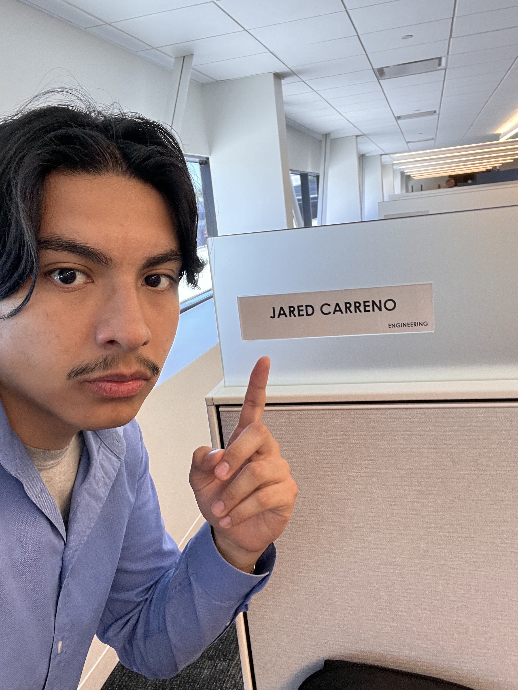
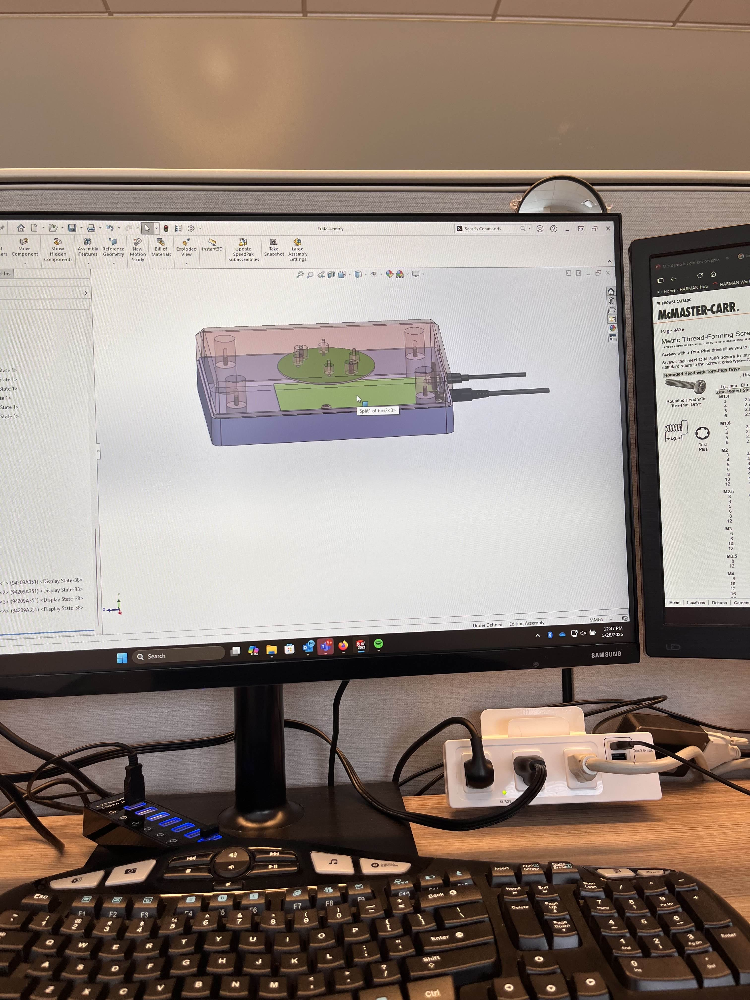
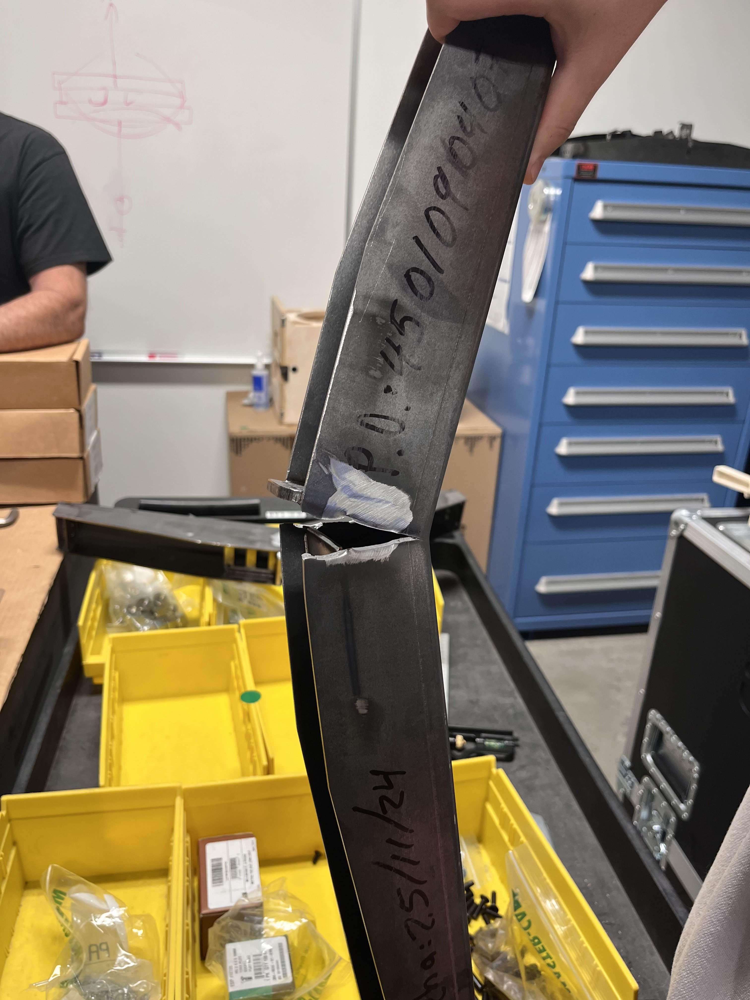
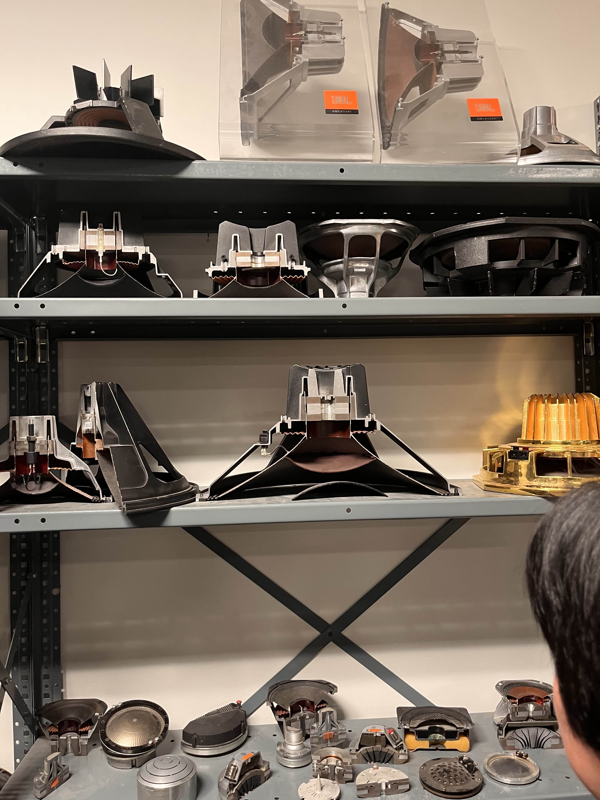

:::: {.columns}

::: {.column width="30%"}
{fig-align="center"}
{fig-align="center"}
{fig-align="center"}
{fig-align="center"}
:::

::: {.column width="50%"}
I spent the summer leading up to my senior year with HARMAN in their Northridge office working alongside the HEA team (HARMAN Embedded Audio). Most of my time was spent working with HEA's Principal Mechanical Engineer, Fred Tubis, designing enclosures and products for customer demos, ensuring that everything was toleranced and could be smoothly assembled. 

I also conducted some in-house IPX testing on some existing JBL products and tested the ultimate tensile strength of stadium trusses that are designed to hold the speaker arrays throughout entire stadiums.

Alongside HEA's Principal Acoustic Systems Engineer, Christian Garcia, I tested, designed, and tuned a customer demo for Britax, a childcare product company. We utilized HARMAN's in-house anechoic chamber to read the frequency response and tuned it to the HARMAN's proprietary target curve using SigmaStudio.
:::

::::

