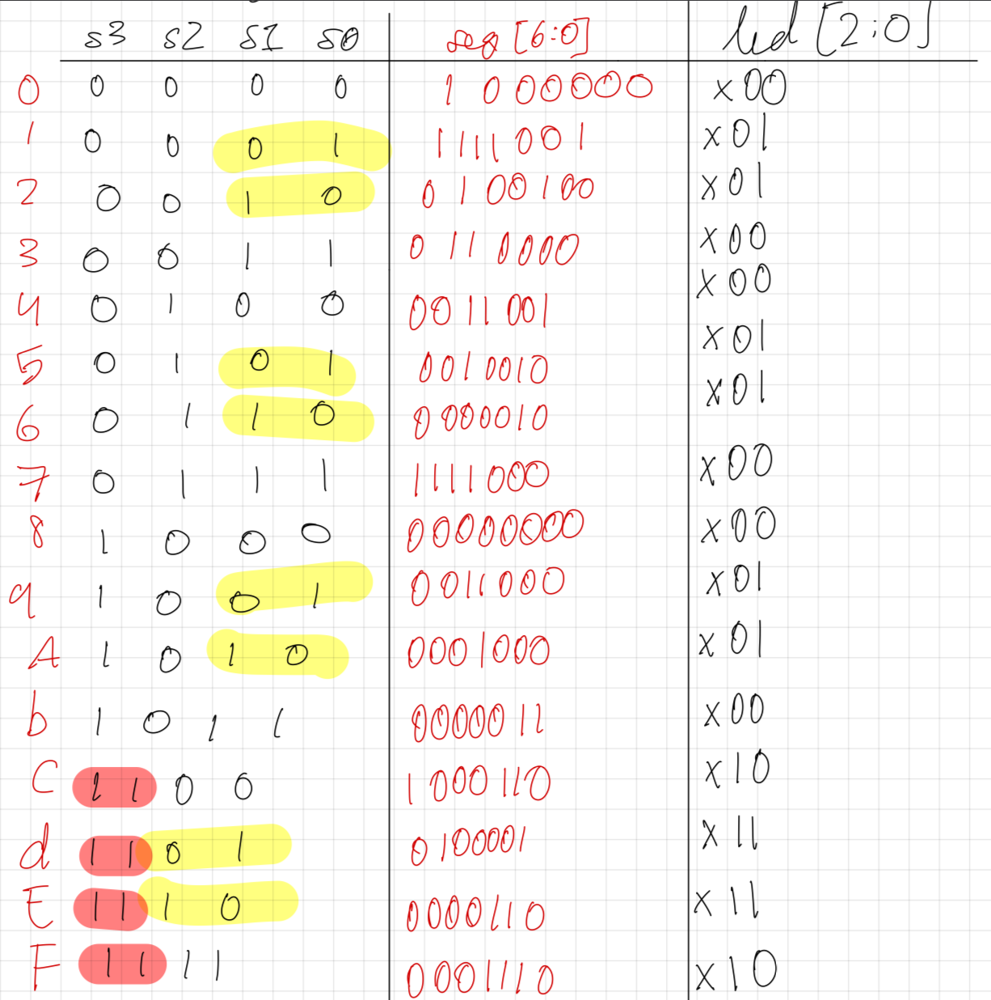
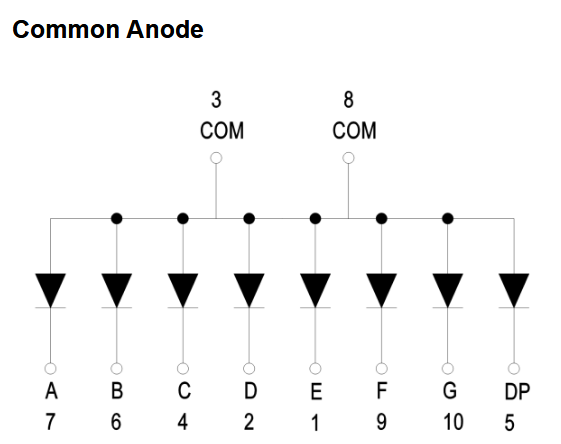
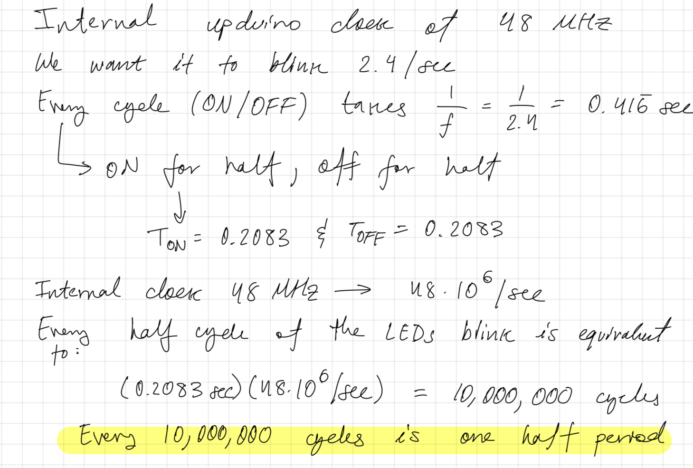
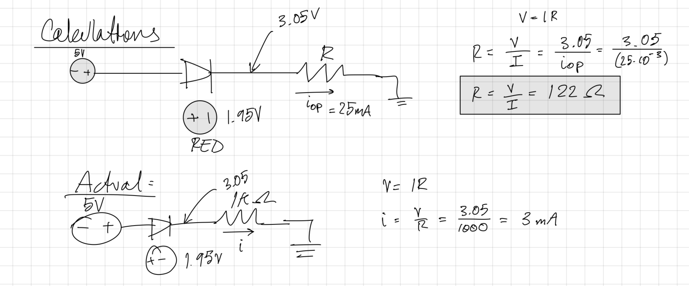
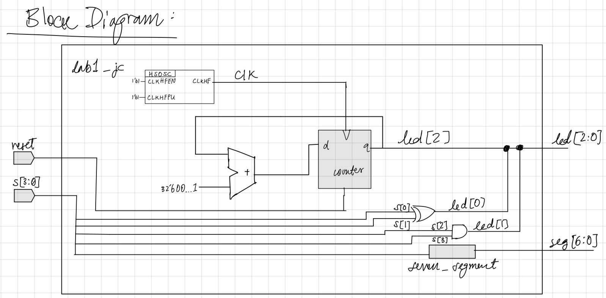
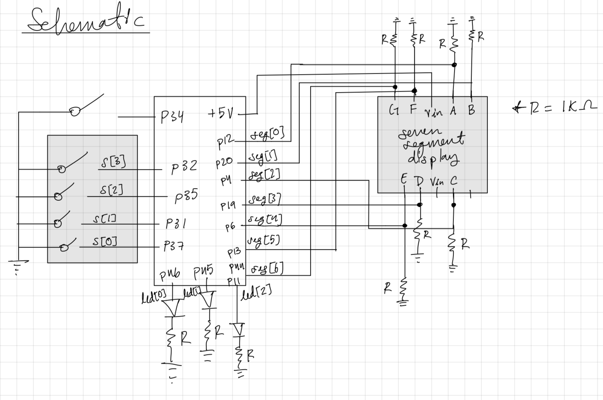
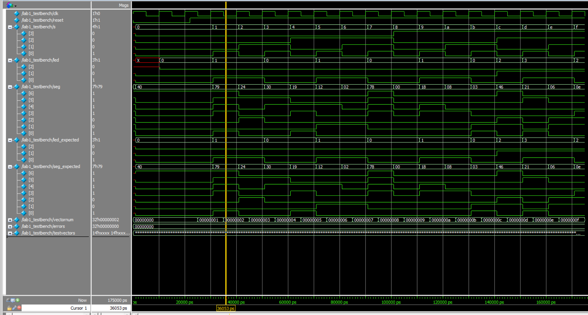
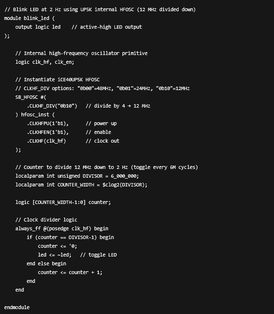

## Introduction
This project served as the initial "board bring-up" and verification phase for a custom FPGA development environment utilizing the UPduino v3.1 (Lattice iCE40) and Nucleo-L432KC. The scope extended beyond simple logic design to include the physical assembly of the hardware platform (soldering headers and components) and the establishment of a complete bitstream generation workflow using Radiant Lattice and Segger Embedded Studio. The primary technical goal was to architect a hardware controller for a 7-segment display and discrete LEDs, verifying the toolchain from electrical assembly to verified hardware synthesis.

## Design and Testing Methodology
{fig-align="center" width=100%}

The interface logic was designed around a 4-bit dip switch input mapping to a hex display decoder. A critical hardware constraint was the use of a **Common Anode** 7-segment display.

{fig-align="center" width=100%}

In this configuration, all LED anodes are tied to the 3.3V rail. Consequently, the FPGA must drive the GPIO pins **LOW (0V)** to create a potential difference and illuminate a segment. I implemented the decoder logic to output these active-low signals based on the truth table in Figure 1.

Parallel to the display logic, I implemented discrete indicators using combinational logic gates:
* `led[0]`: Derived via an XOR operation (`s[0] ^ s[1]`).
* `led[1]`: Derived via an AND operation (`s[2] & s[3]`).
* `led[2]`: Assigned to a hardware heartbeat monitor. I instantiated the FPGA's internal High-Speed Oscillator (HSOSC) at 48 MHz and implemented a clock divider to generate a visible 2.4 Hz blink rate, verifying the chip's internal timing resources were active.

{fig-align="center" width=100%}

As shown in Figure 2, I calculated the required counter depth (approx. 10 million cycles) to toggle the LED state, ensuring the blink frequency was human-readable.

{fig-align="center" width=100%}

Electrical safety was paramount during the hardware assembly. I performed current-limiting calculations (Figure 3) to ensure the FPGA GPIO pins were not over-driven. Although standard calculations suggested ~122Ω resistors, I opted for 1kΩ resistors to prioritize safety and reduce power consumption, validating that brightness remained adequate even at lower currents.

## Technical Documentation:
The Git repository containing the source code of this project can be found here: [Lab 1 Repo](https://github.com/jaredcarreno/e155-lab1).

### Block Diagram
{fig-align="center" width=100%}

The system architecture (Figure 4) illustrates the signal flow: asynchronous inputs `s[3:0]` drive the combinatorial blocks, while the HSOSC block drives the synchronous counter for the heartbeat LED. This separation highlights the mix of asynchronous logic and clocked sequential logic within the top-level module.

### Schematic
{fig-align="center" width=100%}

## Results and Discussion

### Testbench Simulation
Before flashing the hardware, I validated the logic using SystemVerilog testbenches.

{fig-align="center" width=100%}

Figure 6 demonstrates the top-level verification. The simulation confirmed that the combinational logic for `led` and `seg` matched the expected truth table values across all 16 input vectors.

{fig-align="center" width=100%}

Figure 7 isolates the 7-segment decoder logic. The waveform confirms that the module correctly outputs the active-low hex codes corresponding to the binary inputs.

## Conclusion
The project successfully validated the entire FPGA development lifecycle. The on-board HSOSC was correctly instantiated to drive the heartbeat LED, and the active-low decoder logic functioned perfectly with the physical 7-segment display. This "Hello World" of hardware engineering established a reliable platform for future, more complex embedded systems work.

## AI Prototype Summary
{fig-align="center" width=100%}

I attempted to use an LLM to generate the heartbeat LED module, but the results highlighted significant gaps in the AI's understanding of vendor-specific primitives. The AI failed to correctly instantiate the Lattice iCE40 `HSOSC` primitive, hallucinating incorrect port definitions and requiring manual intervention to fix syntax errors. Furthermore, the generated Verilog was verbose and convoluted compared to the standard hardware description practices. This experiment reinforced that while AI can assist with generic logic, it struggles with the specific, proprietary IP blocks often required in FPGA design.