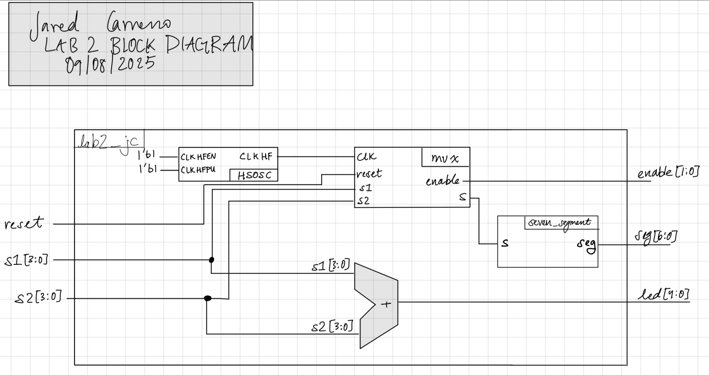
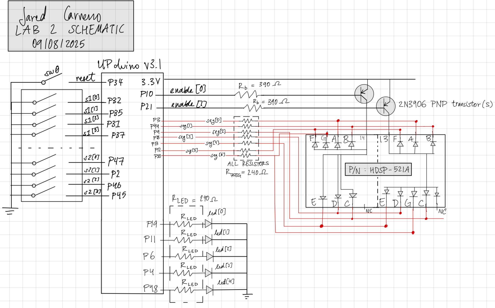
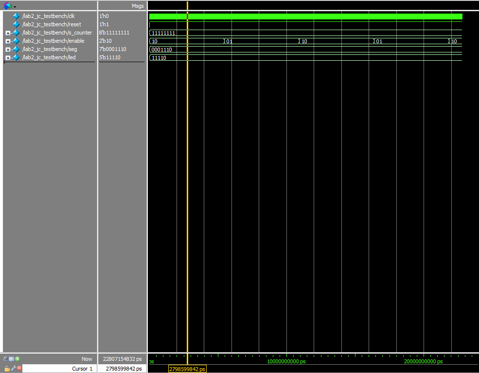
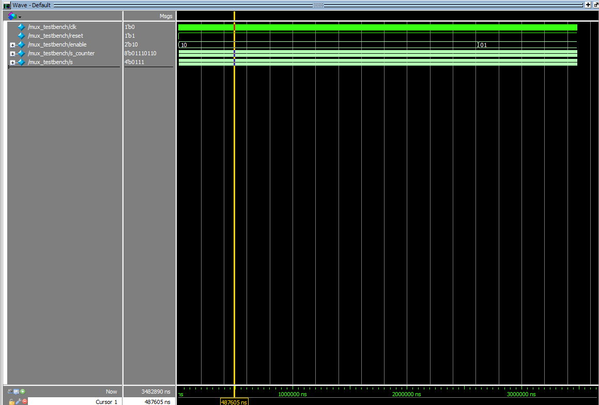
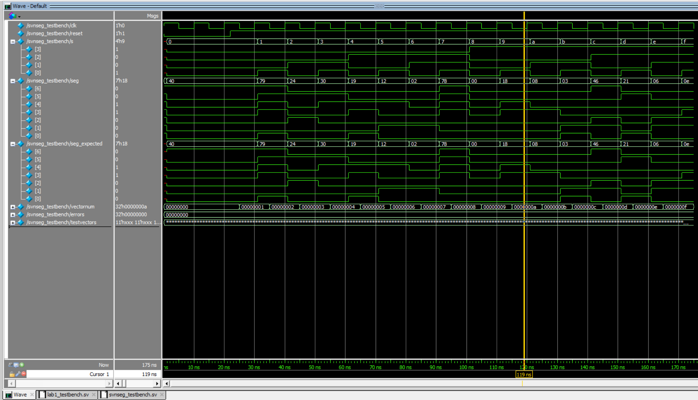
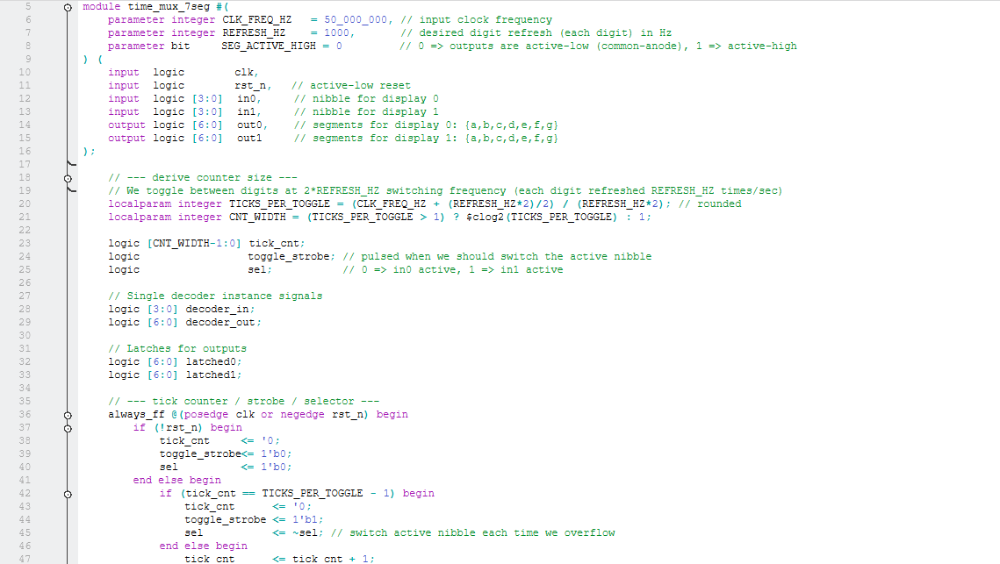
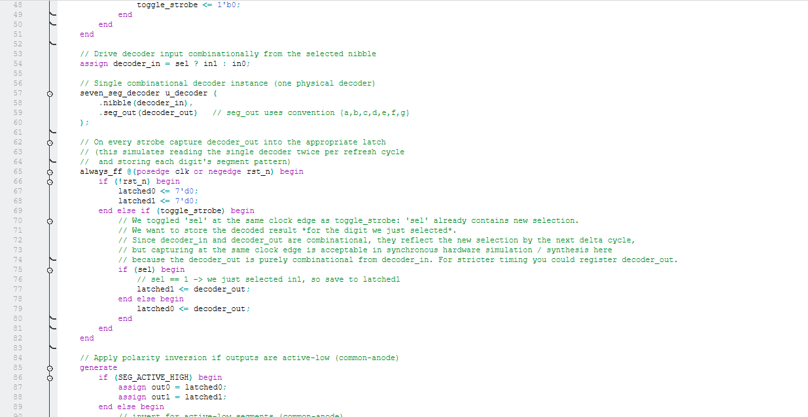
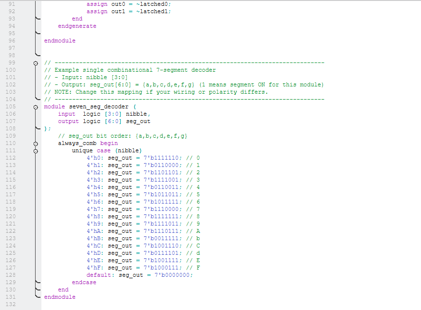
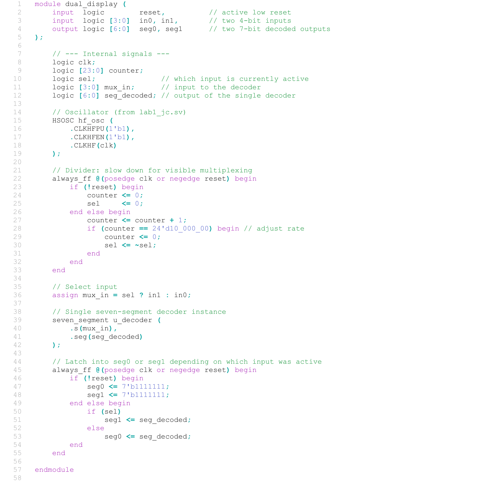

## Introduction
Efficient resource management is a core constraint in embedded systems design. This project addresses the limitation of available GPIO pins by implementing **Time-Division Multiplexing (TDM)** to drive a dual 7-segment display. 

Instead of dedicating separate parallel buses for each digit (which would require 14+ pins), this system utilizes rapid switching to drive two displays over a shared bus. By oscillating power between the units faster than the human eye's flicker fusion threshold—a phenomenon known as Persistence of Vision—the system creates the illusion that both displays are active simultaneously. Additionally, the system performs real-time binary addition of the two 4-bit inputs, displaying the sum on a separate array of LEDs.

## Design and Testing Methodology
The architecture centers on minimizing pin count without sacrificing visual stability. The implementation reuses the 7-segment decoder logic from previous work but introduces a new multiplexing layer driven by the FPGA's high-speed oscillator (`HSOSC`).

**Clock Division and Refresh Rate**
To achieve a stable display, the high-frequency system clock requires significant division. I utilized a 25-bit counter acting as a frequency divider. Through experimental tuning, I determined that the 18th bit of the counter (`counter[18]`) provided the optimal refresh rate.
* **Bit High:** Selects Input 1 (`s1`) and powers Display 0.
* **Bit Low:** Selects Input 2 (`s2`) and powers Display 1.

Speeds lower than this threshold caused visible flickering, while significantly higher speeds could lead to "ghosting" (bleeding of data between digits) due to switching characteristics.

**Transistor-Based Power Switching**
Since the FPGA cannot source sufficient current to drive a 7-segment common anode display directly, I designed a high-side switching circuit using two 2N3906 PNP transistors. 

The FPGA drives the transistor bases via `enable[0]` and `enable[1]`. When the logic drives a base low, the PNP transistor saturates, connecting the 3.3V rail to the corresponding digit's anode, effectively powering it on.

## Technical Documentation:
The Git repository containing the source code of this lab can be found here: [Lab 2 Repo](https://github.com/jaredcarreno/e155-lab2.git).

### Block Diagram
{fig-align="center" width=100%}

The system hierarchy (Figure 1) encapsulates the data flow: the `HSOSC` drives the timing logic, which controls the `mux`. The multiplexer selects between the two 4-bit DIP switch inputs, forwarding the result to the `seven_segment` decoder. Parallel to this, an adder logic block computes the sum of the inputs for the discrete LED indicators.

### Schematic
{fig-align="center" width=100%}

Figure 2 details the physical interface, including the two 4-input DIP switch banks, the current-limiting resistors for the segment lines, and the PNP transistor driver configuration for the digit selection.

## Results and Discussion

### Testbench Simulation
Before hardware synthesis, the logic was verified using SystemVerilog testbenches to ensure timing constraints and logic correctness.

{fig-align="center" width=100%}

The top-level simulation (Figure 3) confirmed that the adder logic correctly sums the asynchronous inputs `s1` and `s2` regardless of the display state.

{fig-align="center" width=100%}

The multiplexer simulation (Figure 4) verified the exclusive switching nature of the design—ensuring `enable[0]` and `enable[1]` are never active simultaneously, which is crucial to prevent current overload or display data corruption.

{fig-align="center" width=100%}

### Conclusion
The project successfully demonstrated a pin-efficient display driver. The final implementation yielded a bright, stable dual-digit readout with no perceptible flicker or ghosting. The integration of PNP transistors for high-side switching proved effective for handling the current requirements of the 7-segment modules, validating the approach of offloading power handling from the FPGA logic pins.

## AI Prototype Summary
I utilized AI to generate an alternative implementation for the multiplexing logic for comparison.

{fig-align="center" width=100%}
{fig-align="center" width=100%}
{fig-align="center" width=100%}

{fig-align="center" width=100%}

The AI-generated code (Figure 6) was syntactically correct and logically sound, though it adopted a different architectural strategy. Instead of my counter-bit selection method, the AI proposed using the positive and negative edges of the clock to toggle between displays. While this is a valid approach for simple toggling, my counter-based implementation allows for easier tuning of the refresh frequency (by selecting different bits) without altering the master clock source.