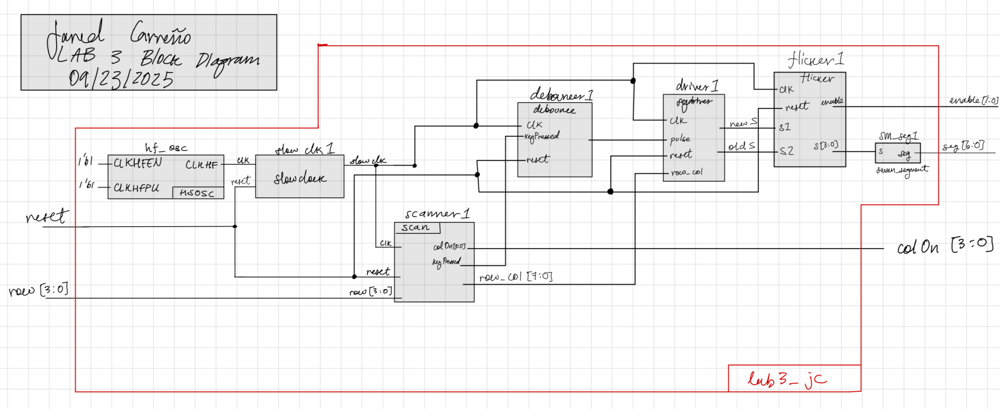
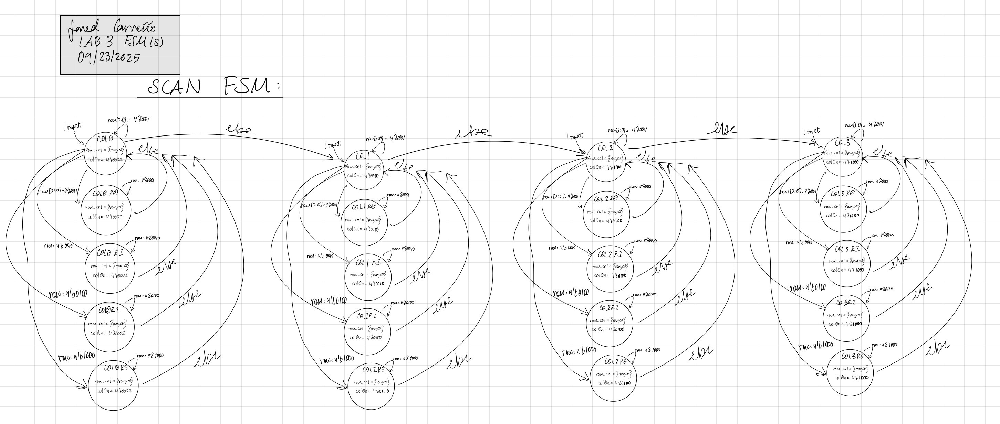
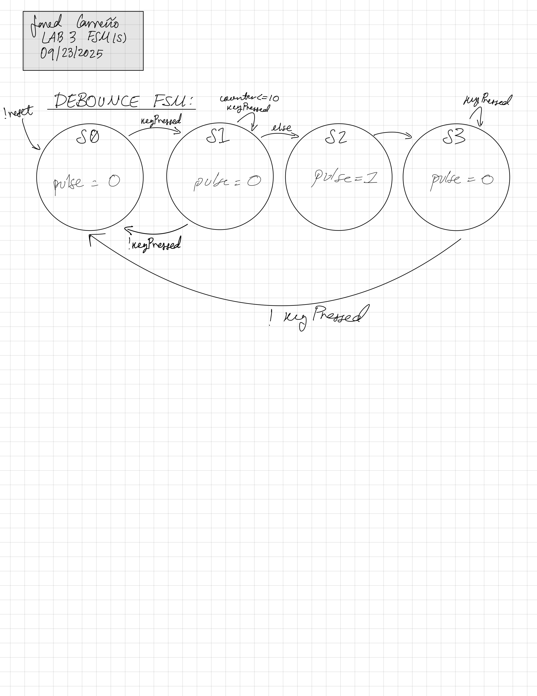
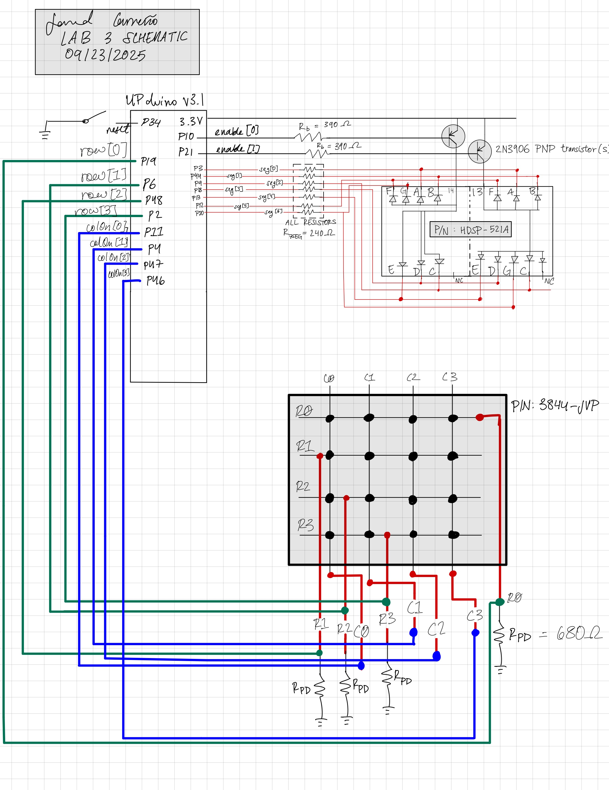

## Introduction
This project focuses on the robust integration of a mechanical 4x4 keypad with an FPGA. A primary challenge in such interfaces is "switch bounce"—the rapid, erratic oscillation of mechanical contacts during actuation—which can trigger multiple false inputs for a single press. 

[Image of switch contact bounce oscilloscope trace]

The objective was to implement a hardware-based debouncing filter and a matrix scanning algorithm to reliably capture inputs. Additionally, I designed a history-buffer display system on a dual 7-segment unit, which shifts values from right to left as new valid inputs are registered.

## Design and Testing Methodology
The system architecture divides the workload into two interacting Finite State Machines (FSMs): the **Scan FSM** and the **Debounce FSM**.

**The Debounce FSM (Signal Integrity)**
As detailed in Figure 3, this FSM acts as a temporal filter. When `keyPressed` goes high, the system enters state `S1` and initiates a counter. The system validates the input only if the signal remains high for a full 50ms duration. If the signal fluctuates (bounces) or drops before this threshold, the FSM resets. Once validated (`S2`), a single `pulse` is generated for the logic layer. The FSM then locks in state `S3` until the key is physically released, preventing repeated registration of a held key.

**The Scan FSM (Matrix Interface)**
To interface with the keypad's grid layout, the Scan FSM (Figure 2) implements a column-driving algorithm. It cycles through one-hot encoded states (`colOn[3:0]`), driving one column high at a time while listening to the rows (`row[3:0]`). 

[Image of 4x4 keypad matrix internal circuit diagram]

This scanning technique allows the FPGA to determine the exact coordinate of a button press `row_col = {row, colOn}` using only 8 GPIO pins for 16 buttons. The logic ensures that only one column is active at any given moment, minimizing bus contention.

## Technical Documentation:
The Git repository containing the source code of this project can be found here: [Lab 3 Repo](https://github.com/jaredcarreno/e155-lab3.git).

### Block Diagram and FSMs
{fig-align="center" width=100%}

{fig-align="center" width=200%}

{fig-align="center" width=100%}

### Schematic
{fig-align="center" width=100%}

## Results and Discussion
The implementation successfully met the core requirements: mechanical noise was effectively filtered, and the shift-register logic correctly displayed the history of inputs. 

During testing, I identified a hardware limitation known as "ghosting" or masking. When switching active columns while a key in the same row is still depressed, the system occasionally failed to register a distinct second press. This is a common artifact in matrix keypads without isolation diodes, where current can back-feed through pressed switches. While the current logic handles single-key inputs robustly, future revisions could address this edge case through more aggressive software filtering or diode-protected hardware.

### Conclusion
This project required an extensive debugging phase, totaling over 60 hours of development time. The majority of this effort was dedicated to logic analyzer tracing to ensure the timing between the scan cycles and the debounce counters was perfectly synchronized. The final result is a reliable input driver that can be reused in future embedded systems projects.

## AI Prototype Summary
I utilized an AI assistant to generate an initial skeleton for the SystemVerilog modules. The results were mixed and required significant refactoring. The AI hallucinated non-existent ports (specifically declaring `out` ports on modules where standard logic types were required) and introduced syntax errors that prevented synthesis. While it provided a rough structural starting point, it failed to produce a correct implementation of the matrix scanning logic, highlighting the necessity of manual design verification. The raw, erroneous AI-generated code is preserved below for reference:

```
module clock_divider(
    input logic clk,        // 20 MHz input clock
    input logic rst_n,      // Active low reset
    output logic scan_clk   // Divided clock (100–200 Hz)
);
    // Target clock frequency: 100 Hz
    // Divider for 20 MHz: 20 MHz / 100 Hz = 200,000
    logic [18:0] counter;  // 19-bit counter for clock division

    always_ff @(posedge clk or negedge rst_n) begin
        if (!rst_n) begin
            counter <= 0;
            scan_clk <= 0;
        end else begin
            if (counter == 199_999) begin
                counter <= 0;
                scan_clk <= ~scan_clk;  // Toggle scan clock
            end else begin
                counter <= counter + 1;
            end
        end
    end
endmodule

module keypad_scanner1(
    input logic clk,            // Clock input (scan clock)
    input logic rst_n,          // Active low reset
    input logic [3:0] rows,     // Row signals (active low)
    output logic [3:0] cols,    // Column signals (active low)
    output logic [3:0] key     // Output the detected key (hex value)
);
    // State machine for scanning rows and columns
    typedef enum logic [1:0] {
        IDLE = 2'b00,
        SCAN = 2'b01,
        DEBOUNCE = 2'b10
    } state_t;

    state_t state, next_state;
    logic [3:0] column_reg, last_cols;
    logic [3:0] key_reg, last_key;
    logic key_pressed;

    always_ff @(posedge clk or negedge rst_n) begin
        if (!rst_n) begin
            state <= IDLE;
            cols <= 4'b1111;  // All columns inactive
            key_reg <= 4'b0000;
            last_cols <= 4'b1111;
        end else begin
            state <= next_state;
        end
    end

    // State machine logic
    always_ff @(state or column_reg or rows or last_cols) begin
        case (state)
            IDLE: begin
                next_state = SCAN;
                cols = 4'b1111;  // All columns inactive
            end
            SCAN: begin
                // Cycle through columns, one active at a time
                if (column_reg == 4'b1110) column_reg = 4'b1101;
                else if (column_reg == 4'b1101) column_reg = 4'b1011;
                else if (column_reg == 4'b1011) column_reg = 4'b0111;
                else column_reg = 4'b1111;
                cols = column_reg;  // Set current column
                key_pressed = |(rows & ~cols);  // Detect key press based on row signals
                if (key_pressed) begin
                    key_reg = rows; // Register key press based on row active
                    next_state = DEBOUNCE;
                end else begin
                    next_state = SCAN;
                end
            end
            DEBOUNCE: begin
                // Debounce the key by ensuring release before registering new key
                if (~|(rows & ~cols)) begin  // No key pressed
                    next_state = SCAN;
                end else begin
                    next_state = DEBOUNCE;
                end
            end
            default: next_state = IDLE;
        endcase
    end

    // Output the detected key
    always_ff @(posedge clk) begin
        if (key_pressed) key = key_reg;
        else key = last_key;
    end
endmodule
```
```
module keypad_one_shot_registration(
    input logic clk,            // Clock input
    input logic rst_n,          // Active low reset
    input logic [3:0] rows,     // Row signals from keypad (active low)
    output logic new_key,       // Single-cycle pulse for new key press
    output logic [3:0] key_code // Detected key code (hex value)
);
    // State machine states
    typedef enum logic [1:0] {
        IDLE = 2'b00,
        PRESSED = 2'b01,
        RELEASED = 2'b10
    } state_t;

    state_t state, next_state;  // Current and next states
    logic [3:0] last_key;       // Store the last detected key
    logic [3:0] current_key;    // Store the current key being pressed

    // Key detection: any active row means a key is pressed
    always_ff @(posedge clk or negedge rst_n) begin
        if (!rst_n) begin
            state <= IDLE;
            new_key <= 0;
            last_key <= 4'b0000;
            key_code <= 4'b0000;
        end else begin
            state <= next_state;
        end
    end

    // Logic for key detection (rows are active low, check if any row is pressed)
    always_ff @(posedge clk) begin
        if (state == IDLE && ~(|rows)) begin
            // Detect the key code when a key is pressed (active low rows)
            current_key <= ~rows;
        end
    end

    // State transition and new key pulse generation
    always_ff @(posedge clk) begin
        case (state)
            IDLE: begin
                if (~(|rows)) begin  // Detect key press (any active row)
                    next_state <= PRESSED;
                    new_key <= 1;  // Generate a one-shot pulse
                end else begin
                    next_state <= IDLE;
                    new_key <= 0;  // No new key, reset pulse
                end
            end

            PRESSED: begin
                if (~(|rows)) begin  // Key is still pressed
                    next_state <= PRESSED;
                    new_key <= 0;  // No new key until key is released
                end else begin
                    next_state <= RELEASED;  // Key released, move to RELEASED state
                end
            end

            RELEASED: begin
                if (~(|rows)) begin  // Key press has been released
                    next_state <= IDLE;
                    key_code <= current_key;  // Capture the key code
                    last_key <= current_key;
                end else begin
                    next_state <= RELEASED;
                end
            end

            default: begin
                next_state <= IDLE;
            end
        endcase
    end
endmodule
```
```
module keypad_scanner2(
    input logic clk,              // Clock input (divided clock)
    input logic rst_n,            // Active low reset
    input logic [3:0] rows,       // Row signals from keypad (active low)
    output logic [3:0] key_code,  // Detected key code (4-bit hex value)
    output logic key_pressed      // Boolean indicating key press status
);

    // Define FSM states
    typedef enum logic [1:0] {
        SCAN_IDLE = 2'b00,         // Wait for key press
        SCAN_COL_0 = 2'b01,        // Scan column 0
        SCAN_COL_1 = 2'b10,        // Scan column 1
        SCAN_COL_2 = 2'b11         // Scan column 2
    } state_t;

    state_t state, next_state;    // Current and next states
    logic [3:0] col_mask;         // Column select mask
    logic [3:0] detected_key;     // Detected key code (4 bits)

    // State machine for scanning columns
    always_ff @(posedge clk or negedge rst_n) begin
        if (!rst_n) begin
            state <= SCAN_IDLE;
            col_mask <= 4'b1111;  // All columns inactive initially
        end else begin
            state <= next_state;
        end
    end

    // Column scanning logic: one column is active (low) at a time
    always_ff @(posedge clk) begin
        case (state)
            SCAN_IDLE: begin
                col_mask <= 4'b1111;  // No column active
            end
            SCAN_COL_0: begin
                col_mask <= 4'b1110;  // Only column 0 is active (low)
            end
            SCAN_COL_1: begin
                col_mask <= 4'b1101;  // Only column 1 is active (low)
            end
            SCAN_COL_2: begin
                col_mask <= 4'b1011;  // Only column 2 is active (low)
            end
            default: begin
                col_mask <= 4'b1111;  // Default: no column active
            end
        endcase
    end

    // Detect the key code based on the active column and row signals
    always_ff @(posedge clk) begin
        case (state)
            SCAN_COL_0: begin
                if (~rows[0]) detected_key <= 4'b0001;  // Row 0, Column 0
                else if (~rows[1]) detected_key <= 4'b0100;  // Row 1, Column 0
                else if (~rows[2]) detected_key <= 4'b0111;  // Row 2, Column 0
                else if (~rows[3]) detected_key <= 4'b1000;  // Row 3, Column 0
            end
            SCAN_COL_1: begin
                if (~rows[0]) detected_key <= 4'b0010;  // Row 0, Column 1
                else if (~rows[1]) detected_key <= 4'b0101;  // Row 1, Column 1
                else if (~rows[2]) detected_key <= 4'b0110;  // Row 2, Column 1
                else if (~rows[3]) detected_key <= 4'b1001;  // Row 3, Column 1
            end
            SCAN_COL_2: begin
                if (~rows[0]) detected_key <= 4'b0011;  // Row 0, Column 2
                else if (~rows[1]) detected_key <= 4'b0110;  // Row 1, Column 2
                else if (~rows[2]) detected_key <= 4'b0111;  // Row 2, Column 2
                else if (~rows[3]) detected_key <= 4'b1011;  // Row 3, Column 2
            end
            default: detected_key <= 4'b0000; // Default: no key detected
        endcase
    end

    // Key press indicator: Any key pressed when one of the rows is active
    always_ff @(posedge clk) begin
        if (~(|rows))  // If any row is active, a key is pressed
            key_pressed <= 1'b1;
        else
            key_pressed <= 1'b0;
    end

    // Output the detected key code
    always_ff @(posedge clk) begin
        key_code <= detected_key;
    end

    // State machine transitions: cycle through the columns
    always_ff @(posedge clk) begin
        case (state)
            SCAN_IDLE: next_state <= SCAN_COL_0;
            SCAN_COL_0: next_state <= SCAN_COL_1;
            SCAN_COL_1: next_state <= SCAN_COL_2;
            SCAN_COL_2: next_state <= SCAN_IDLE;
            default: next_state <= SCAN_IDLE;
        endcase
    end
endmodule
```
```
module top_level (
    input logic clk,               // Clock from internal oscillator
    input logic rst_n,             // Active low reset
    input logic [3:0] rows,        // Row signals from keypad (active low)
    output logic [6:0] seg_a,      // Seven segment display segments for first digit
    output logic [6:0] seg_b,      // Seven segment display segments for second digit
    output logic an0,              // Enable signal for first digit
    output logic an1               // Enable signal for second digit
);

    // Signals for keypad scanner and one-shot registration
    logic [3:0] key_code;         // Detected key code
    logic new_key;                // New key detected (one-shot signal)
    logic key_pressed;            // Key pressed indicator

    // Signals for last two keys
    logic [3:0] most_recent_key;  // Most recent key (new key)
    logic [3:0] older_key;        // Older key (last key)

    // Signals for 7-segment display
    logic [3:0] display_digit;    // Digit to be displayed on the multiplexed display
    logic mux_select;             // Multiplexer to select which digit to display

    // Instantiate the keypad scanner
    keypad_scanner2 scanner (
        .clk(clk),
        .rst_n(rst_n),
        .rows(rows),
        .key_code(key_code),
        .key_pressed(key_pressed)
    );

    // Instantiate the keypad one-shot registration module
    keypad_one_shot_registration one_shot (
        .clk(clk),
        .rst_n(rst_n),
        .rows(rows),
        .new_key(new_key),
        .key_code(key_code)
    );

    // Process for shifting the last two keys (older <- most recent; most recent <- new)
    always_ff @(posedge clk or negedge rst_n) begin
        if (!rst_n) begin
            most_recent_key <= 4'b0000;
            older_key <= 4'b0000;
        end else if (new_key) begin
            // Shift the keys when a new key is detected
            older_key <= most_recent_key;
            most_recent_key <= key_code;
        end
    end

    // Clock divider logic to generate a slower clock for display multiplexing
    logic clk_display;
    reg [15:0] clk_divider;  // Divider for the clock (adjust for desired multiplexing rate)
    always_ff @(posedge clk or negedge rst_n) begin
        if (!rst_n) begin
            clk_divider <= 16'b0;
            clk_display <= 0;
        end else begin
            // Divide the clock to get a slower rate (e.g., 60 Hz for multiplexing)
            if (clk_divider == 16'd49999) begin  // Adjust this value for desired rate
                clk_divider <= 16'b0;
                clk_display <= ~clk_display;  // Toggle the display clock
            end else begin
                clk_divider <= clk_divider + 1'b1;
            end
        end
    end

    // Multiplexed display logic: alternate between displaying the two digits
    always_ff @(posedge clk_display or negedge rst_n) begin
        if (!rst_n) begin
            mux_select <= 0;
            display_digit <= 4'b0000;
            an0 <= 1;
            an1 <= 0;
        end else begin
            if (mux_select) begin
                display_digit <= most_recent_key;
                an0 <= 0;
                an1 <= 1;  // Enable second digit
            end else begin
                display_digit <= older_key;
                an0 <= 1;  // Enable first digit
                an1 <= 0;
            end
            mux_select <= ~mux_select;  // Toggle between the two digits
        end
    end

    // Instantiate the seven-segment display decoder for both digits
    seven_segment seg1(
        .in(display_digit),
        .out(seg_a)
    );

    seven_segment seg2(
        .in(display_digit),
        .out(seg_b)
    );
endmodule
```
