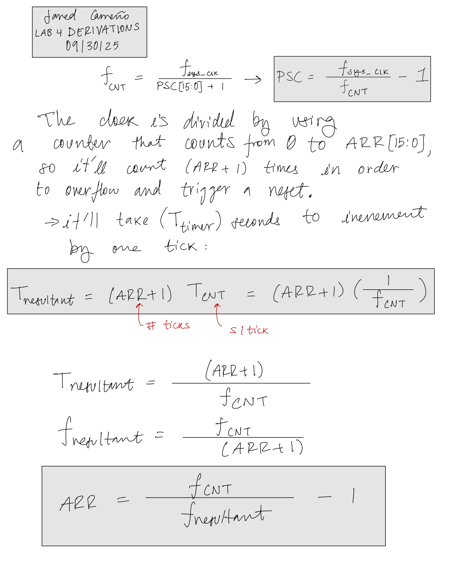
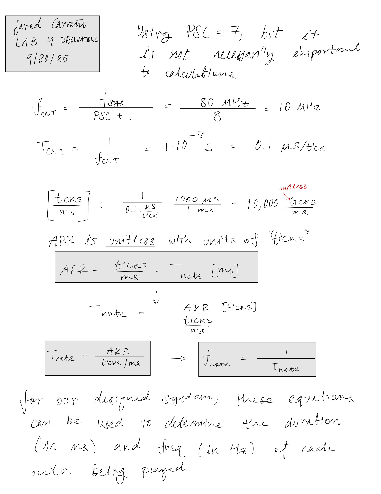
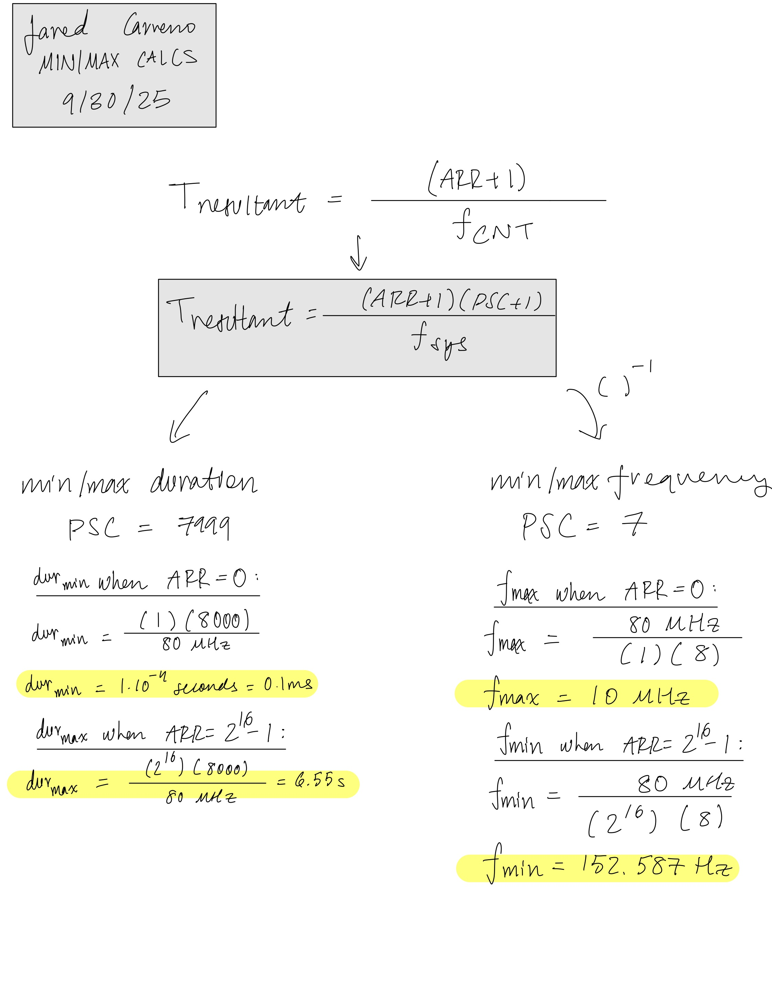
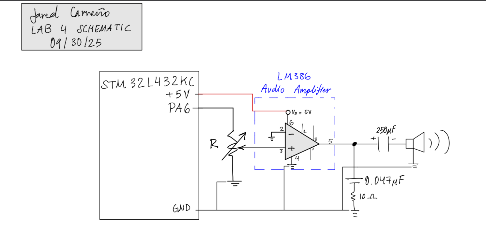
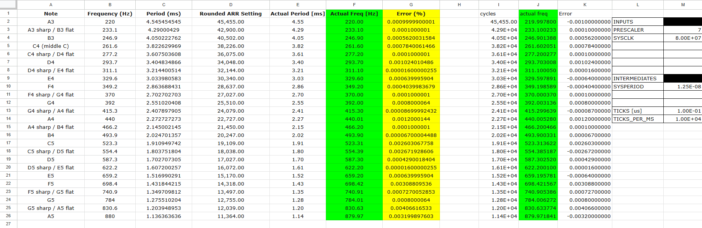
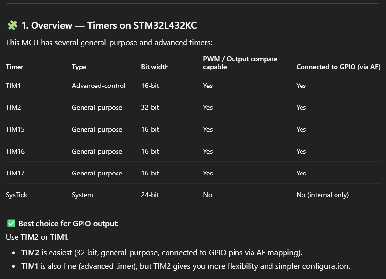
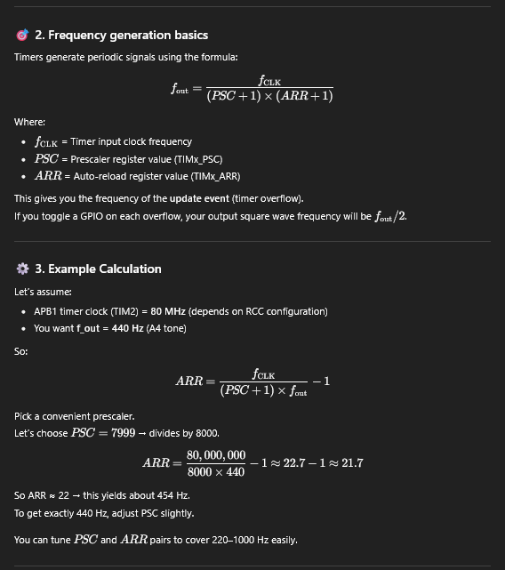
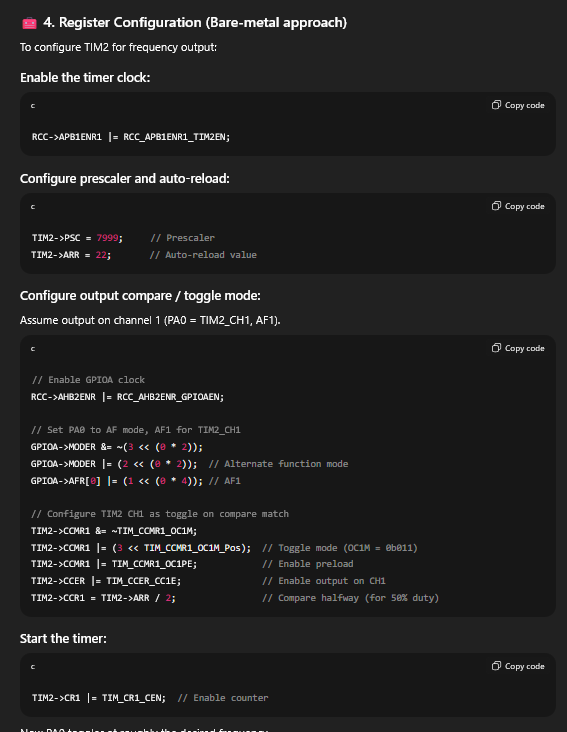
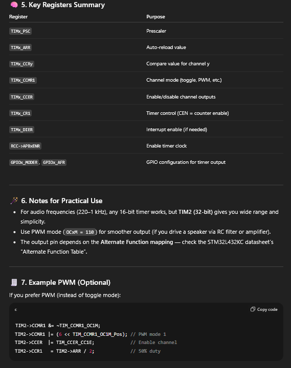

## Introduction
This project explores direct hardware control on the STM32L432KC by implementing a music player using bare-metal timer manipulation. The objective was to synthesize audio by generating precise square waves on a GPIO pin. By manually configuring the MCU's timers to dictate GPIO states, I successfully created a system capable of rendering melodies with accurate frequency and note duration without relying on high-level audio libraries.

## Design and Testing Methodology
The core architecture leverages two specific timers, TIM15 and TIM16, chosen for their dual GPIO and PWM mode capabilities and shared register layouts, which streamlined the struct definitions in C. 

To achieve audio fidelity, I manipulated the system clock ($f_{sys} = 80 \text{ MHz}$) using distinct prescaler (PSC) values for each timer:
* **PWM Generation:** A lower PSC of 7 was selected to maintain high frequency resolution, ensuring the pitch of the notes remained accurate.
* **Duration Control:** A higher PSC of 7999 was applied to the duration timer, allowing for precise tracking of note length in milliseconds.

Balancing these prescalers was critical; early testing revealed that incorrect PSC ratios led to frequency drift or shortened note durations when the clock speed outpaced the counter's capacity.

I utilized the Auto-Reload Register (ARR) to define the specific frequency of the output wave. The pulse remains HIGH until the counter matches the ARR value. To ensure a clean square wave, the Capture/Compare Register (CCR1) is set to exactly half the ARR value, forcing the signal LOW at the midpoint and producing a consistent 50% duty cycle.

## Technical Documentation:
The Git repository containing the source code of this project can be found here: [STM32 Music Player Repo](https://github.com/jaredcarreno/e155-lab4.git).

### Derivations and Calculations
To determine the register values required for specific musical notes, I derived equations relating the ARR, note period ($T_{note}$), and frequency ($f_{note}$). Figures 1 and 2 detail these derivations. Figure 3 provides the justification for the chosen prescaler values by calculating the operational boundaries—specifically the maximum and minimum frequencies and durations the system can handle before overflowing or losing resolution.

{fig-align="center" width=100%}

{fig-align="center" width=100%}

{fig-align="center" width=200%}

### Schematic
{fig-align="center" width=100%}

To verify the signal physically, I integrated an LM386 audio amplifier to drive a speaker, including a potentiometer for volume control. The circuit implementation, shown in Figure 4, follows the standard application circuit provided in the LM386 datasheet.

## Results and Discussion
The implementation successfully produced accurate frequencies and durations for complex melodies. Validation involved comparing the theoretical register values against the measured output. As shown in Figure 5, the percent error between the target musical frequencies and the actual system output was negligible.

The development process relied heavily on on-chip debugging. Using Segger's debug mode, I was able to inspect registers in real-time and force specific pin states, which was essential for isolating timing issues during the initial setup.

{fig-align="center" width=400%}

### Conclusion
The system successfully rendered recognized pieces such as *Fur Elise* and *Mary Had a Little Lamb*, demonstrating the robustness of the timer configuration. While the learning curve for manual register configuration was steep, this project significantly improved my ability to navigate technical datasheets and configure MCU peripherals at the hardware level.

## AI Prototype Summary
I utilized an AI assistant to generate initial boilerplate code for the timer setup. The AI produced a sensible starting point, likely due to the abundance of STM32 documentation available online. However, it notably failed to configure the Event Generation Register (EGR), which is critical for updating the timer's shadow registers. This highlighted the importance of manual verification against the reference manual when using AI-generated driver code.

{fig-align="center" width=100%}
{fig-align="center" width=100%}
{fig-align="center" width=100%}
{fig-align="center" width=100%}