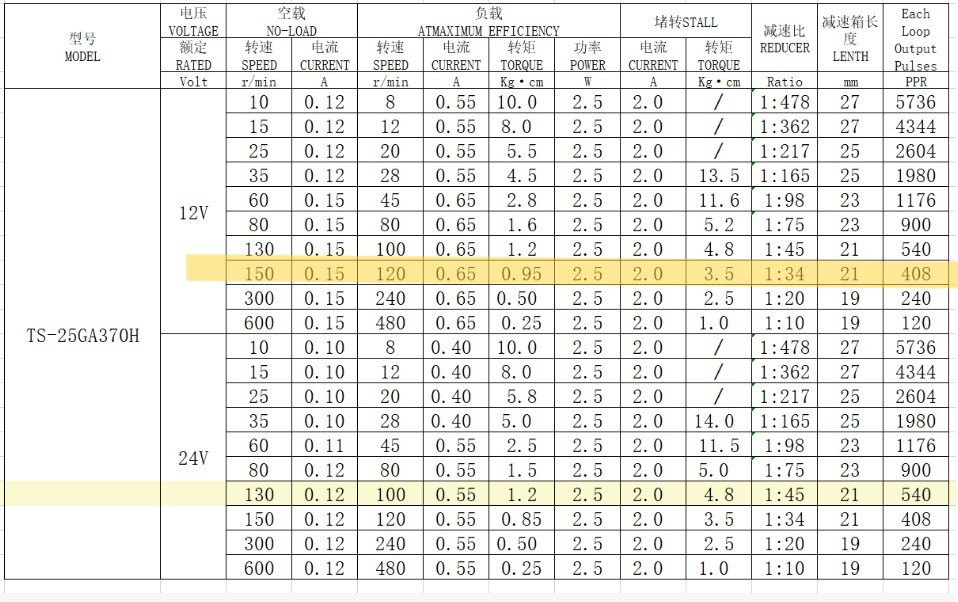
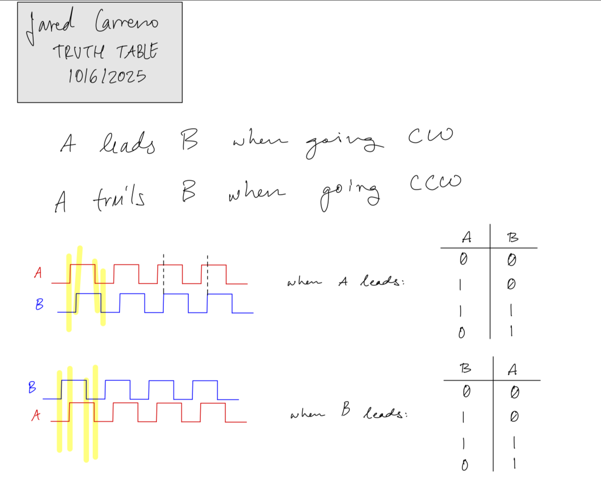
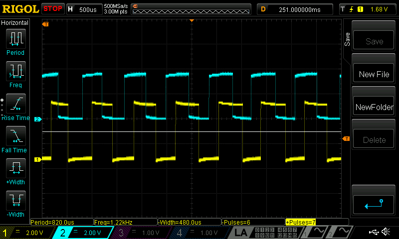
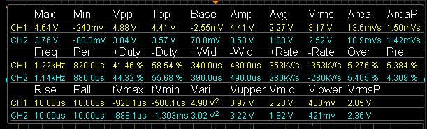
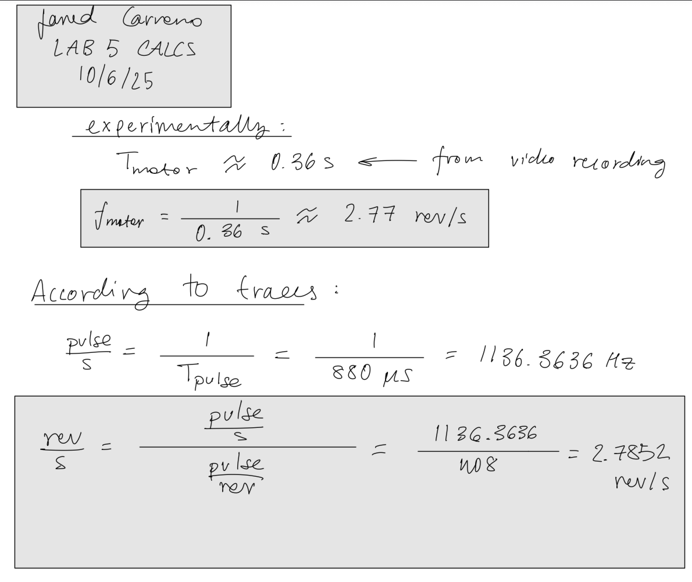
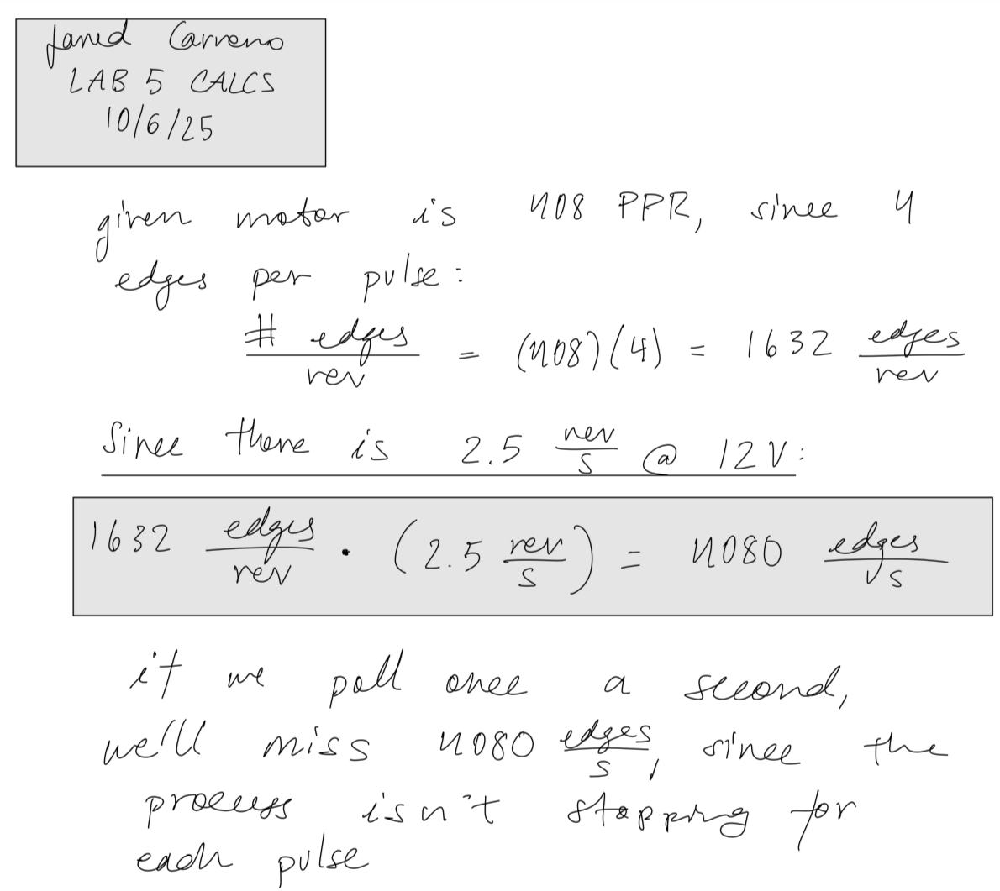
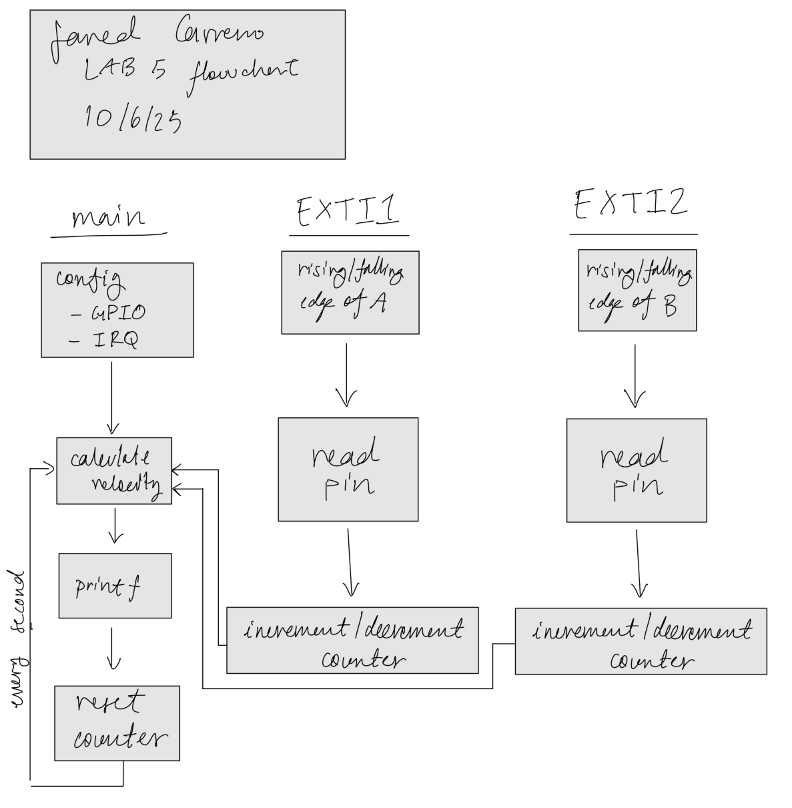
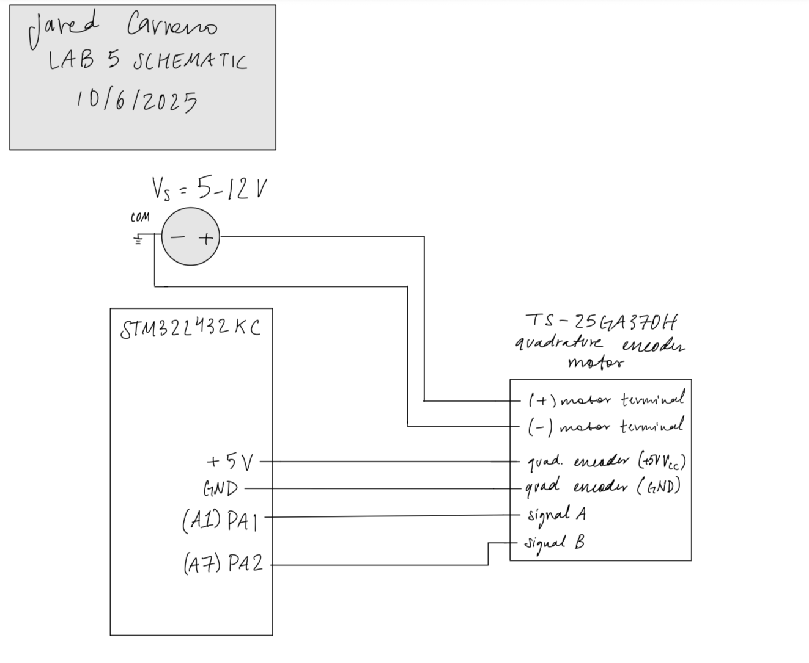

## Introduction
Precise motor control requires accurate, real-time feedback. In this project, I engineered a velocity tracking system using the STM32L432KC to interface with a DC motor's quadrature encoder. The objective was to determine rotational speed (in $rev/s$) by decoding high-speed digital pulses. 

[Image of quadrature encoder internal mechanism]

Rather than relying on inefficient polling loops, I implemented an event-driven architecture using hardware interrupts to capture every rising and falling edge of the encoder's A and B channels, ensuring no data loss even at high rotational speeds.

## Design and Testing Methodology
The core design philosophy was to offload the timing-critical signal acquisition to the MCU's hardware interrupt controller, freeing up the main loop for data processing and display.

### Interrupt Configuration
I configured the External Interrupt/Event Controller (EXTI) to monitor pins PA1 and PA2. This involved a direct manipulation of the STM32's NVIC (Nested Vector Interrupt Controller):
1.  **Global Enable:** Unlocked interrupts via CMSIS `_enable_irq()`.
2.  **Masking:** Configured `IMR1` to unmask the specific lines for our GPIOs.
3.  **Trigger Selection:** Enabled both Rising (`RTSR1`) and Falling (`FTSR1`) edge triggers to maximize resolution.

### Decoding Logic
The direction and speed logic relies on the phase relationship between channels A and B. 

[Image of quadrature encoder signal phase diagram]

As detailed in the truth table (Figure 2), the lead/lag relationship determines direction:
* **Clockwise (CW):** Channel A leads Channel B ($A \uparrow$ when $B=0$).
* **Counter-Clockwise (CCW):** Channel B leads Channel A ($B \uparrow$ when $A=0$).

By handling four distinct interrupt cases (Rising/Falling for A and B), the ISR (Interrupt Service Routine) increments or decrements a volatile counter. Velocity is then derived by normalizing this count against the motor's rated Pulses Per Revolution (PPR).

{fig-align="center" width=100%}



## Technical Documentation:
The Git repository containing the source code of this project can be found here: [Lab 5 Repo](https://github.com/jaredcarreno/e155-lab5.git).

### Velocity Verification
To validate the software calculations, I performed a physical audit of the system. I captured the encoder signals on an oscilloscope (Figure 3) to measure the raw pulse period. Additionally, I cross-referenced this with a video analysis of the motor's physical rotation.

{fig-align="center" width=100%}

{fig-align="center" width=100%}

{fig-align="center" width=100%}

### Polling v.s. Interrupts
A critical analysis of this project was comparing the theoretical performance of polling versus interrupts. 

[Image of polling vs interrupt timing diagram]

Polling is time-driven; if the processor checks the pin state every 1ms, it is blind to any events occurring between checks. As shown in my calculations (Figure 6), a polling approach at 1kHz would miss over 4,000 signal edges per second at standard motor speeds. Interrupts are event-driven; the hardware pauses the main context to handle the event immediately, ensuring data integrity at the cost of context-switching overhead.

{fig-align="center" width=100%}

### Flowchart 
{fig-align="center" width=100%}

### Schematic
{fig-align="center" width=100%}

## Results and Discussion
The interrupt-based implementation proved robust, yielding a steady reading of approximately $\approx 2.5 \text{ rev/s}$. During testing, I observed hardware variance across different motor units, with speeds ranging from 2.5 to 2.9 rev/s, highlighting the importance of closed-loop feedback in mechanical systems.

### Terminal Output
```
counter: 0 
The motor is spinning at 0.000000 rev/s 
counter: 0 
The motor is spinning at 0.000000 rev/s 
counter: 0 
The motor is spinning at 0.000000 rev/s 
counter: 0 
The motor is spinning at 0.000000 rev/s 
counter: 0 
The motor is spinning at 0.000000 rev/s 
counter: -3708 
The motor is spinning at -2.271446 rev/s 
counter: -4371 
The motor is spinning at -2.677696 rev/s 
counter: -4374 
The motor is spinning at -2.678921 rev/s 
counter: -4372 
The motor is spinning at -2.678309 rev/s 
counter: -4374 
The motor is spinning at -2.679534 rev/s 
counter: -4374 
The motor is spinning at -2.680147 rev/s 
counter: -4376 
The motor is spinning at -2.680760 rev/s 
counter: -4376 
The motor is spinning at -2.680760 rev/s 
counter: -4376 
The motor is spinning at -2.680760 rev/s 
counter: -4376 
The motor is spinning at -2.680760 rev/s 
counter: -4376 
The motor is spinning at -2.681373 rev/s 
counter: -4379 
The motor is spinning at -2.682598 rev/s 
counter: -4378 
The motor is spinning at -2.681985 rev/s 
counter: -4378 
The motor is spinning at -2.681985 rev/s 
counter: -4379 
The motor is spinning at -2.682598 rev/s 
counter: -3002 
The motor is spinning at -1.839461 rev/s 
counter: -25 
The motor is spinning at -0.015319 rev/s 
counter: 0 
The motor is spinning at 0.000000 rev/s 
```
<!-- ### Testbench Simulation
{fig-align="center" width=100%}

{fig-align="center" width=100%}

{fig-align="center" width=100%}
-->

### Conclusion
In conclusion, my implementation was able to successfully read the speed of a motor using its integrated quadrature encoder. This lab was really fun to do, as it demonstrated to me how to properly interface with hardware, as well as read data using a microcontroller's interrupts. Overall, this project took roughly 15 hours to complete.

## AI Prototype Summary
The code produced by the LLM appears to have a similar approach to my implementation, with a very noticeable difference being the use of  UART clock. Even though my implementation uses printf(), it does so without a UART clock, so it's interesting to see the AI take an approach with something I've never used before. After running the code on my setup, I determined that the AI implementation was a working one. Output from the AI implementation is shown below.

```
// ======================================================================
// ============================================================================
// main.c
// Quadrature encoder using EXTI interrupts + UART printf + direction
// ============================================================================

#include "main.h"

volatile int32_t encoder_count = 0;
volatile int32_t last_encoder_count = 0;
volatile float   encoder_velocity = 0.0f;
volatile int8_t  encoder_dir = 0;       // 1 = CW, -1 = CCW, 0 = stopped
volatile uint32_t print_counter = 0;

// ---------------------------------------------------------------------------
// UART2 initialization and printf redirection
// ---------------------------------------------------------------------------
void UART2_Init(void)
{
    // Enable GPIOA and USART2 clocks
    RCC->AHB2ENR  |= RCC_AHB2ENR_GPIOAEN;
    RCC->APB1ENR1 |= RCC_APB1ENR1_USART2EN;

    // Configure PA2 (TX) and PA3 (RX) as AF7
    GPIOA->MODER &= ~(GPIO_MODER_MODE2_Msk | GPIO_MODER_MODE3_Msk);
    GPIOA->MODER |=  (0x2 << GPIO_MODER_MODE2_Pos) | (0x2 << GPIO_MODER_MODE3_Pos);
    GPIOA->AFR[0] &= ~((0xF << (2 * 4)) | (0xF << (3 * 4)));
    GPIOA->AFR[0] |=  (7 << (2 * 4)) | (7 << (3 * 4));  // AF7 = USART2

    // Configure USART2: 115200 baud, 8N1
    USART2->BRR = SystemCoreClock / 115200; // assuming APB1 = SystemCoreClock
    USART2->CR1 = USART_CR1_TE | USART_CR1_RE | USART_CR1_UE;
}

// Retarget printf to USART2
int __io_putchar(int ch)
{
    while (!(USART2->ISR & USART_ISR_TXE)); // wait for TX buffer empty
    USART2->TDR = ch;
    return ch;
}

// ---------------------------------------------------------------------------
// Encoder + EXTI setup
// ---------------------------------------------------------------------------
void Encoder_Init(void)
{
    RCC->AHB2ENR |= RCC_AHB2ENR_GPIOAEN;

    // PA1 and PA2 as input with pull-ups
    GPIOA->MODER &= ~(GPIO_MODER_MODE1_Msk | GPIO_MODER_MODE2_Msk);
    GPIOA->PUPDR &= ~(GPIO_PUPDR_PUPD1_Msk | GPIO_PUPDR_PUPD2_Msk);
    GPIOA->PUPDR |=  (1U << GPIO_PUPDR_PUPD1_Pos) | (1U << GPIO_PUPDR_PUPD2_Pos);

    RCC->APB2ENR |= RCC_APB2ENR_SYSCFGEN;

    // Map EXTI lines to PA1, PA2 (EXTI1, EXTI2)
    SYSCFG->EXTICR[0] &= ~(SYSCFG_EXTICR1_EXTI1_Msk | SYSCFG_EXTICR1_EXTI2_Msk);

    EXTI->IMR1  |= (EXTI_IMR1_IM1 | EXTI_IMR1_IM2);
    EXTI->RTSR1 |= (EXTI_RTSR1_RT1 | EXTI_RTSR1_RT2);
    EXTI->FTSR1 |= (EXTI_FTSR1_FT1 | EXTI_FTSR1_FT2);

    NVIC_SetPriority(EXTI1_IRQn, 2);
    NVIC_EnableIRQ(EXTI1_IRQn);
    NVIC_SetPriority(EXTI2_IRQn, 2);
    NVIC_EnableIRQ(EXTI2_IRQn);
}

// ---------------------------------------------------------------------------
// TIM2 1 ms periodic interrupt
// ---------------------------------------------------------------------------
void Timer2_Init(void)
{
    RCC->APB1ENR1 |= RCC_APB1ENR1_TIM2EN;

    DELAY_TIM->PSC = (SystemCoreClock / 1000000) - 1; // 1 MHz tick
    DELAY_TIM->ARR = 1000 - 1;                        // 1 ms overflow
    DELAY_TIM->CNT = 0;
    DELAY_TIM->DIER |= TIM_DIER_UIE;
    DELAY_TIM->CR1  |= TIM_CR1_CEN;

    NVIC_SetPriority(TIM2_IRQn, 3);
    NVIC_EnableIRQ(TIM2_IRQn);
}

// ---------------------------------------------------------------------------
// Compute velocity (called every 1 ms by TIM2 interrupt)
// ---------------------------------------------------------------------------
void compute_velocity(void)
{
    int32_t delta = encoder_count - last_encoder_count;
    last_encoder_count = encoder_count;

    // Determine direction based on delta sign
    if (delta > 0)      encoder_dir = 1;
    else if (delta < 0) encoder_dir = -1;
    else                encoder_dir = 0;

    // rev/s = delta / (PPR * 4 * 0.001s)
    encoder_velocity = (float)delta / (PPR * 4.0f * 0.001f);
}

// ---------------------------------------------------------------------------
// Encoder update helper
// ---------------------------------------------------------------------------
static inline void Encoder_Update(void)
{
    uint32_t A = (GPIOA->IDR & (1 << 1)) ? 1 : 0;
    uint32_t B = (GPIOA->IDR & (1 << 2)) ? 1 : 0;

    if (A == B)
        encoder_count++;
    else
        encoder_count--;
}

// ---------------------------------------------------------------------------
// Interrupt Handlers
// ---------------------------------------------------------------------------
void EXTI1_IRQHandler(void)
{
    if (EXTI->PR1 & EXTI_PR1_PIF1)
    {
        EXTI->PR1 = EXTI_PR1_PIF1;
        Encoder_Update();
    }
}

void EXTI2_IRQHandler(void)
{
    if (EXTI->PR1 & EXTI_PR1_PIF2)
    {
        EXTI->PR1 = EXTI_PR1_PIF2;
        Encoder_Update();
    }
}

void TIM2_IRQHandler(void)
{
    if (DELAY_TIM->SR & TIM_SR_UIF)
    {
        DELAY_TIM->SR &= ~TIM_SR_UIF;

        compute_velocity();

        // Print every 100 ms
        print_counter++;
        if (print_counter >= 100)
        {
            print_counter = 0;

            if (encoder_dir == 0)
                printf("Stopped (0.00 rev/s)\r\n");
            else
                printf("Speed: %.2f rev/s (%s)\r\n",
                       encoder_velocity * encoder_dir,   // signed speed
                       (encoder_dir > 0) ? "CW" : "CCW");
        }
    }
}

// ---------------------------------------------------------------------------
// Main
// ---------------------------------------------------------------------------
int main(void)
{
    SystemCoreClockUpdate();
    UART2_Init();
    Encoder_Init();
    Timer2_Init();

    printf("\r\nQuadrature Encoder + Direction Test Start\r\n");

    while (1)
    {
        __WFI(); // Sleep until interrupt
    }
}
```
### Terminal Output
```
Quadrature Encoder + Direction Test Start
Stopped (0.00 rev/s)
Stopped (0.00 rev/s)
Stopped (0.00 rStopped (0.topped (0.00 rev/s)
Stopped (0.00 rtopped (0.00 rev/s)
0.00Sto0.00 rev/s)
Speed: 0.61 rev/s (peedpeed: 0.61 rev/s (CCW)
Stopped (0.00 repeedpeed: 0.61 rev/s (CCW)
Stopped (0.0peed: 0.61 rev/s (CC(0.00 rev/s)
Stoppe(0.0(0.00 rev/s)
St(0.0d (0d (0.00 rev/s)
Speed: 0.61 rev/s (CW)
Stopd (0.00 rev/s)
Speed: 0.61 rev/s (CW)
Stopd (0.00 rev/s)
Speed: 0.61 rev/s (CW)
Stopd (0S0.00 rev/s)
Speed: 0.61 rev/s (CW)
Sto0.000.00 rev/s)
Speed: 0.00 rev/s)
Speed: 0.61 rev/s (CW)
Stopped (0.00 rev/s)
Speed: 0.61 rev/s (CCW)
Stopped (0.00 rev/s)
Stopped (0.00 rev/s)
Speed: 0.61 rev/s (CW)
Stopped (0.00 rev/s)
Speed: 0.61 rev/s (CCW)
Stopped (0.00 rev/s)
Speed: 0.61 rev/s (CW)
Stopped (0.00 rev/s)
Stopped (0.00 rev/s)
Speed: 0.61 rev/s (CCW)
Stopped (0.00 rev/s)
Speed: 0.61 rev/s (CW)
Stopped (0.00 rev/s)
Speed: 0.61 rev/s (CCW)
Stopped (0.00 rev/s)
Speed: 0.61 rev/s (CW)
Stopped (0.00 rev/s)
Stopped (0.00 rev/s)
Stopped (0.00 rev/s)
```