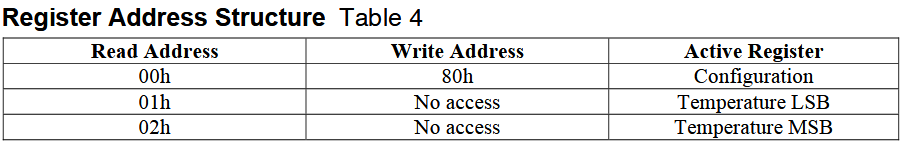
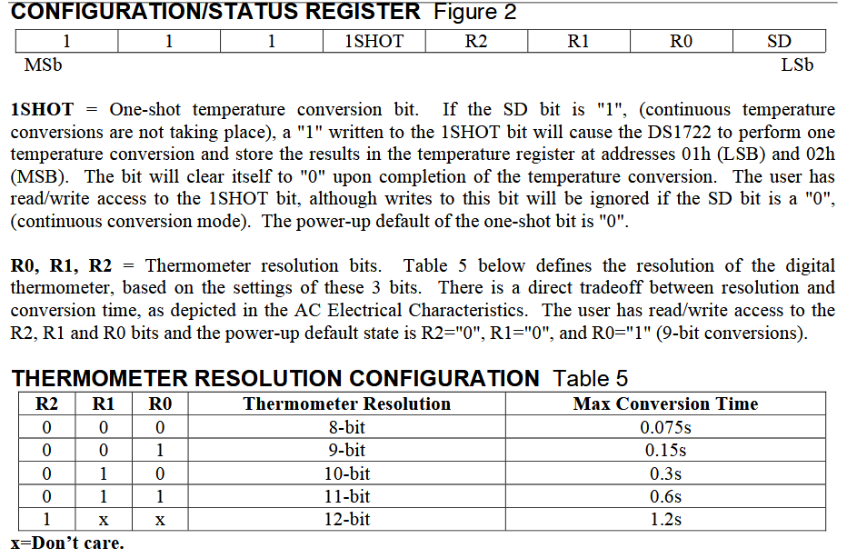
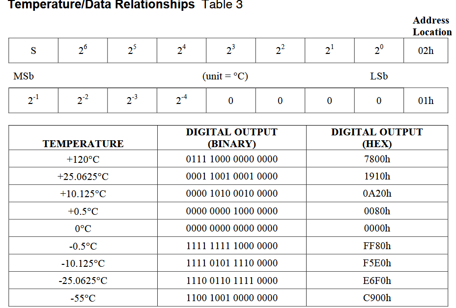
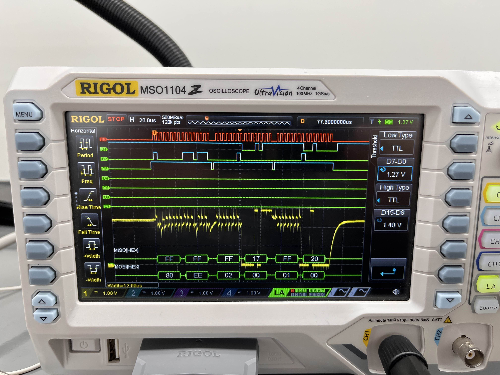
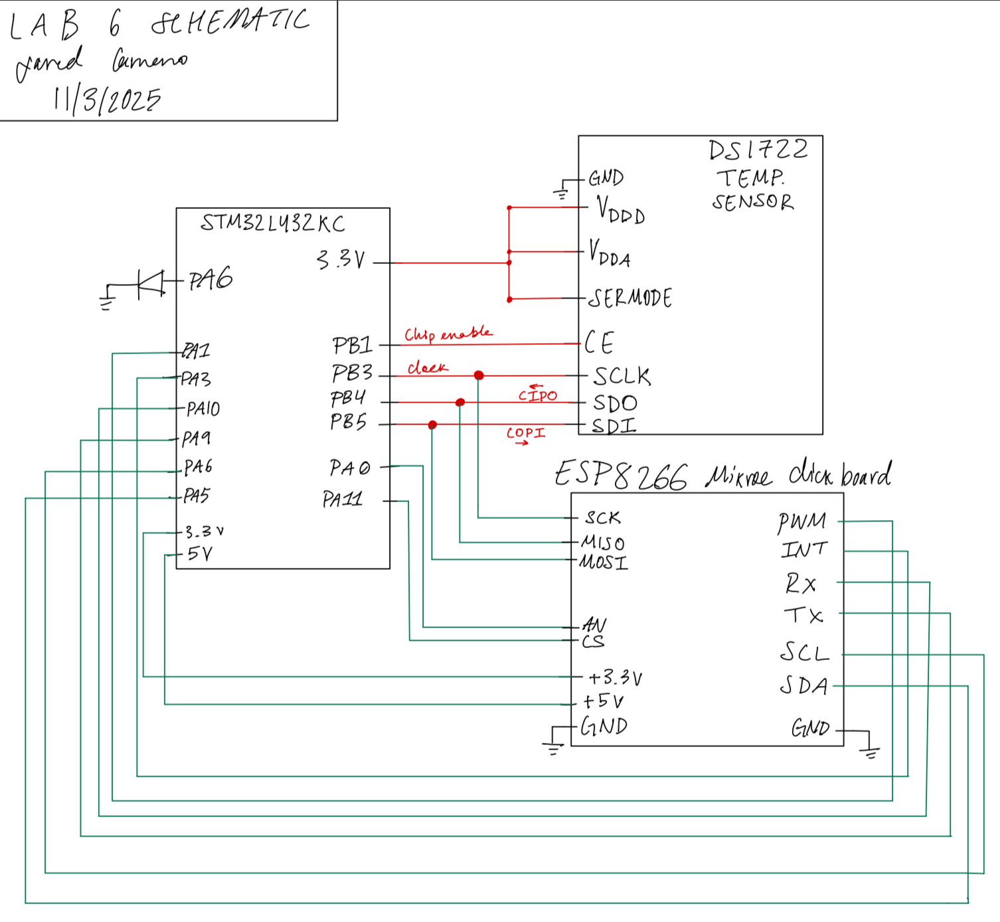
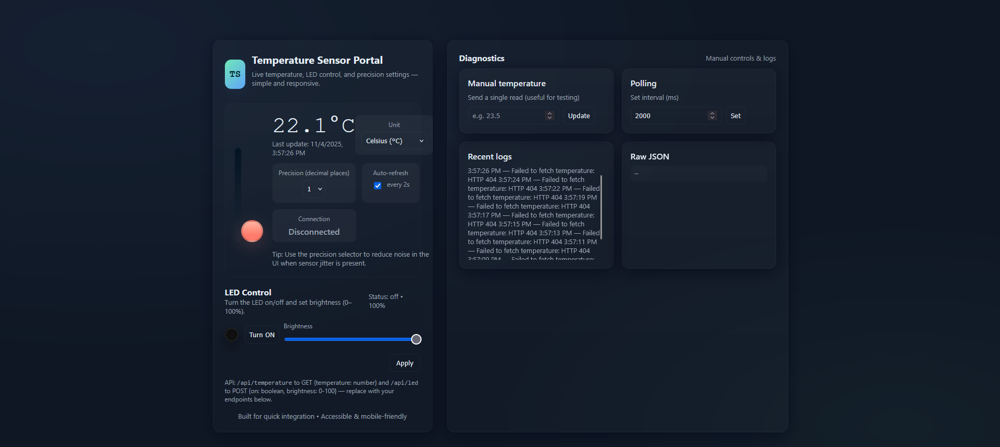

## Introduction
This project bridges the gap between low-level sensor drivers and high-level IoT interfaces. I integrated an STM32L432KC microcontroller with a DS1722 digital thermometer and an ESP8266 Wi-Fi module to create a remote, user-interactive temperature monitoring station. The system allows users to view real-time data and dynamically adjust the sensor's resolution via a web interface, demonstrating full-stack embedded control.

## Design and Testing Methodology
The system architecture relies on a dual-interface approach: **SPI** for high-speed sensor data acquisition and **UART** for network communication.

### SPI Sensor Driver (DS1722)
The DS1722 communicates via a 3-wire SPI interface. I implemented a custom driver to manage the specific register addressing required by the sensor. 

As detailed in Figure 1, the device uses specific addresses for the LSB (0x01) and MSB (0x02) of the temperature data. The driver manages the `CS` (Chip Select) line manually to frame the transaction.
1.  **Resolution Control:** The system writes to the Configuration Register (0x80) to set the bit depth (Figure 2). This allows the user to trade off between conversion speed and precision.
2.  **Data Acquisition:** To read the temperature, the driver sends the read address followed by dummy bytes (0x00). This clocking action allows the DS1722 to shift out the temperature data on the MISO line.
3.  **Data Processing:** The raw data is received as two distinct bytes. I concatenated these into a single 16-bit integer and applied the conversion factor shown in Figure 3 (dividing by 256) to derive the Celsius value.

{fig-align="center" width=100%}

{fig-align="center" width=100%}

{fig-align="center" width=100%}

### UART & Wi-Fi Bridge (ESP8266)
The STM32 acts as the web server's backend. It constructs the HTML payload—including CSS for styling and JavaScript for button logic—and transmits it over UART to the ESP8266. The main system loop monitors the UART buffer for incoming HTTP requests (e.g., a user clicking "Change Resolution"). Upon receiving a valid request, the STM32 updates the DS1722's configuration register, performs a new read, and regenerates the webpage with the updated resolution and temperature.

## Technical Documentation:
The Git repository containing the source code of this lab can be found here: [Lab 6 Repo](https://github.com/jaredcarreno/e155-lab6.git).

### Oscilloscope Traces of SPI Transactions
To verify the driver timing, I captured the SPI bus during a resolution change request.

{fig-align="center" width=100%}

Figure 4 confirms the successful transaction: the Clock (Yellow) drives the data transfer, while the MOSI (Blue) sends the configuration command. The distinct packet structure verifies that the manual bit-banging/SPI peripheral configuration is respecting the setup and hold times of the sensor.

### Schematic
{fig-align="center" width=100%}

## Results and Discussion

### Conclusion
The project successfully demonstrated a complete IoT data path. The system reliably responded to user inputs, changing the sensor's physical configuration register in real-time and reflecting the data on the web dashboard. This lab reinforced the importance of understanding distinct serial protocols and how to synchronize blocking hardware calls (SPI) with asynchronous network events (UART).

## AI Prototype Summary
I tasked an AI assistant with generating the project code to compare against my manual implementation. The results provided a stark contrast between high-level generation and low-level hardware understanding.

**The Good:** The AI generated a visually stunning, modern HTML/CSS interface (Figure 6) that was far superior to my basic template. It utilized gradients, responsive cards, and nice typography.

**The Bad:** The C-level driver code was functionally flawed. As seen in the generated code below, the AI attempted to read the MSB and LSB from sequential SPI transfers *without* correctly addressing the distinct memory locations (0x01 vs 0x02). Furthermore, it hallucinated the read configuration address as 0x81 (it is actually handled via the 0x80 register with the MSB high). This serves as a reminder that while AI is excellent for boilerplate and frontend design, it struggles with the specific register maps of hardware peripherals.

{fig-align="center" width=100%}

### Corresponding HTML code
``` 
<!doctype html>
<html lang="en">
<head>
  <meta charset="utf-8" />
  <meta name="viewport" content="width=device-width,initial-scale=1" />
  <title>Temperature Sensor Portal</title>
  <meta name="description" content="Web portal to show temperature, control LED, and choose precision" />
  <style>
    :root{
      --bg:#0f1724;
      --card:#0b1220;
      --muted:#9aa4b2;
      --accent:#6ee7b7; /* mint */
      --accent-2:#60a5fa; /* blue */
      --glass: rgba(255,255,255,0.04);
      --success:#10b981;
      --danger:#fb7185;
      --radius:14px;
      --mono: ui-monospace, SFMono-Regular, Menlo, Monaco, "Roboto Mono", "Segoe UI Mono", "Courier New", monospace;
      color-scheme: dark;
    }
    *{box-sizing:border-box}
    html,body{height:100%}
    body{
      margin:0;
      font-family: Inter, ui-sans-serif, system-ui, -apple-system, "Segoe UI", Roboto, "Helvetica Neue", Arial;
      background: radial-gradient(1200px 600px at 10% 10%, rgba(96,165,250,0.06), transparent), radial-gradient(800px 400px at 90% 90%, rgba(110,231,183,0.035), transparent), var(--bg);
      color:#e6eef6;
      -webkit-font-smoothing:antialiased;
      -moz-osx-font-smoothing:grayscale;
      padding:32px;
      display:flex;
      align-items:center;
      justify-content:center;
    }

    .layout{
      width:100%;
      max-width:1100px;
      display:grid;
      grid-template-columns: 420px 1fr;
      gap:28px;
    }

    .card{
      background: linear-gradient(180deg, rgba(255,255,255,0.02), rgba(255,255,255,0.01));
      border-radius:var(--radius);
      padding:22px;
      box-shadow: 0 8px 30px rgba(2,6,23,0.6);
      border:1px solid rgba(255,255,255,0.03);
    }

    header .brand{
      display:flex;gap:12px;align-items:center;margin-bottom:12px
    }
    .logo{
      width:56px;height:56px;border-radius:12px;background:linear-gradient(135deg,var(--accent),var(--accent-2));display:flex;align-items:center;justify-content:center;font-weight:700;color:#052a2a;font-family:var(--mono);font-size:18px;box-shadow:0 6px 20px rgba(96,165,250,0.08);
    }
    h1{font-size:20px;margin:0}
    p.lead{margin:6px 0 18px;color:var(--muted);font-size:13px}

    /* Temperature big panel */
    .thermo{
      display:flex;gap:18px;align-items:center;padding:18px;border-radius:12px;background:linear-gradient(180deg, rgba(255,255,255,0.01), transparent);border:1px solid rgba(255,255,255,0.02);
    }
    .thermo .meter{
      width:110px;height:220px;position:relative;display:flex;align-items:end;justify-content:center;padding-bottom:10px
    }
    .bulb{
      width:42px;height:42px;background:linear-gradient(180deg,#ffb4a2 0%, #ff7b6b 70%);border-radius:50%;box-shadow:0 8px 30px rgba(255,123,107,0.2);border:3px solid rgba(0,0,0,0.15);
    }
    .scale{
      width:12px;height:180px;background:linear-gradient(180deg,#031321 0%, rgba(255,255,255,0.02) 100%);border-radius:8px;padding:6px;display:flex;flex-direction:column;align-items:center;justify-content:flex-end
    }
    .mercury{
      width:100%;background:linear-gradient(180deg,var(--accent-2), var(--accent));border-radius:6px;transition:height 600ms cubic-bezier(.2,.9,.2,1), background 400ms;
    }

    .info{
      flex:1;display:flex;flex-direction:column;gap:8px
    }
    .tempBig{font-family:var(--mono);font-size:44px;margin:0}
    .tempSmall{color:var(--muted);font-size:13px}

    .controls{display:flex;gap:12px;margin-top:12px;flex-wrap:wrap}
    .control{background:var(--glass);border-radius:10px;padding:10px 12px;min-width:110px;text-align:center}
    .control label{display:block;font-size:12px;color:var(--muted);margin-bottom:6px}
    .control .value{font-weight:600;font-size:16px}

    .row{display:flex;gap:12px}

    /* LED card */
    .led-panel{display:flex;flex-direction:column;gap:12px}
    .led-visual{display:flex;align-items:center;gap:12px}
    .led-dot{width:26px;height:26px;border-radius:999px;box-shadow:0 6px 24px rgba(0,0,0,0.6), 0 0 18px rgba(0,0,0,0.2) inset;border:2px solid rgba(255,255,255,0.06);transition:transform 220ms}
    .led-dot.on{box-shadow:0 10px 40px rgba(96,165,250,0.18), 0 0 20px rgba(96,165,250,0.18);transform:scale(1.05)}

    input[type=range]{width:100%}
    select,input[type=number],button{background:transparent;border:1px solid rgba(255,255,255,0.04);padding:8px;border-radius:8px;color:inherit}
    button{cursor:pointer}

    /* right column */
    .panel-list{display:grid;grid-template-columns:repeat(2,1fr);gap:16px}

    .card.small{padding:16px}
    .muted{color:var(--muted);font-size:13px}

    footer{margin-top:16px;color:var(--muted);font-size:13px;text-align:center}

    /* responsiveness */
    @media (max-width:980px){
      .layout{grid-template-columns:1fr;max-width:760px}
      .thermo{flex-direction:row}
    }
  </style>
</head>
<body>
  <div class="layout">
    <section class="card">
      <header>
        <div class="brand">
          <div class="logo">TS</div>
          <div>
            <h1>Temperature Sensor Portal</h1>
            <p class="lead">Live temperature, LED control, and precision settings — simple and responsive.</p>
          </div>
        </div>
      </header>

      <div class="thermo" role="region" aria-label="Temperature status">
        <div class="meter" aria-hidden="true">
          <div class="scale">
            <div id="mercury" class="mercury" style="height:30%"></div>
          </div>
          <div style="margin-top:10px;display:flex;justify-content:center;width:100%">
            <div class="bulb"></div>
          </div>
        </div>

        <div class="info">
          <div>
            <div style="display:flex;align-items:center;justify-content:space-between">
              <div>
                <div class="tempBig" id="tempValue">--.-°C</div>
                <div class="tempSmall" id="tempHint">Last update: —</div>
              </div>
              <div style="text-align:right">
                <div class="control" style="min-width:140px">
                  <label for="unitSelect">Unit</label>
                  <select id="unitSelect" aria-label="Select temperature unit">
                    <option value="C">Celsius (°C)</option>
                    <option value="F">Fahrenheit (°F)</option>
                  </select>
                </div>
              </div>
            </div>

            <div class="controls">
              <div class="control">
                <label for="precision">Precision (decimal places)</label>
                <select id="precision">
                  <option value="0">0</option>
                  <option value="1" selected>1</option>
                  <option value="2">2</option>
                  <option value="3">3</option>
                </select>
              </div>

              <div class="control">
                <label>Auto-refresh</label>
                <div style="display:flex;gap:8px;align-items:center;justify-content:center">
                  <input type="checkbox" id="autoRefresh" checked />
                  <label for="autoRefresh" class="muted">every 2s</label>
                </div>
              </div>

              <div class="control" style="min-width:160px">
                <label>Connection</label>
                <div class="value" id="connStatus">Disconnected</div>
              </div>

            </div>
          </div>

          <div style="margin-top:6px;color:var(--muted);font-size:13px">Tip: Use the precision selector to reduce noise in the UI when sensor jitter is present.</div>

        </div>
      </div>

      <div style="margin-top:18px" class="led-panel">
        <div style="display:flex;justify-content:space-between;align-items:center">
          <div>
            <div style="font-weight:700">LED Control</div>
            <div class="muted">Turn the LED on/off and set brightness (0–100%).</div>
          </div>
          <div id="ledInfo" class="muted">Status: off</div>
        </div>

        <div class="led-visual">
          <div id="ledDot" class="led-dot" style="background:#111"></div>
          <div style="flex:1">
            <div style="display:flex;gap:8px;align-items:center">
              <button id="ledToggle">Turn ON</button>
              <div style="flex:1">
                <label for="brightness" style="display:block;font-size:12px;color:var(--muted);margin-bottom:6px">Brightness</label>
                <input type="range" id="brightness" min="0" max="100" value="100" />
              </div>
            </div>
          </div>
        </div>

        <div style="display:flex;gap:8px;justify-content:flex-end">
          <button id="applyLed" style="padding:8px 12px;border-radius:10px">Apply</button>
        </div>

        <div class="muted" style="font-size:12px">API: <code>/api/temperature</code> to GET {temperature: number} and <code>/api/led</code> to POST {on: boolean, brightness: 0-100} — replace with your endpoints below.</div>
      </div>

      <footer>
        <div>Built for quick integration • Accessible & mobile-friendly</div>
      </footer>
    </section>

    <aside class="card">
      <div style="display:flex;justify-content:space-between;align-items:center;margin-bottom:10px">
        <div style="font-weight:700">Diagnostics</div>
        <div style="font-size:13px;color:var(--muted)">Manual controls & logs</div>
      </div>

      <div class="panel-list">
        <div class="card small">
          <div style="font-weight:600">Manual temperature</div>
          <div class="muted" style="margin-top:8px">Send a single read (useful for testing)</div>
          <div style="margin-top:10px;display:flex;gap:8px">
            <input id="manualTemp" type="number" placeholder="e.g. 23.5" />
            <button id="sendManual">Update</button>
          </div>
        </div>

        <div class="card small">
          <div style="font-weight:600">Polling</div>
          <div class="muted" style="margin-top:8px">Set interval (ms)</div>
          <div style="margin-top:10px;display:flex;gap:8px">
            <input id="pollInterval" type="number" value="2000" />
            <button id="setPoll">Set</button>
          </div>
        </div>

        <div class="card small">
          <div style="font-weight:600">Recent logs</div>
          <div id="logs" class="muted" style="margin-top:8px;max-height:180px;overflow:auto;font-size:13px">No logs yet.</div>
        </div>

        <div class="card small">
          <div style="font-weight:600">Raw JSON</div>
          <pre id="raw" style="font-size:12px;margin:8px 0;max-height:160px;overflow:auto;background:rgba(255,255,255,0.02);padding:8px;border-radius:8px;color:var(--muted)">—</pre>
        </div>
      </div>
    </aside>
  </div>

  <script>
    /* Configuration: point these to your real endpoints. */
    const CONFIG = {
      tempEndpoint: '/api/temperature', // GET -> { temperature: number }
      ledEndpoint: '/api/led', // POST -> { on: boolean, brightness: number }
      fallbackMock: true, // if true, UI will simulate values when endpoints fail
    };

    const el = id => document.getElementById(id);
    const tempValueEl = el('tempValue');
    const tempHintEl = el('tempHint');
    const mercuryEl = el('mercury');
    const connStatusEl = el('connStatus');
    const rawEl = el('raw');
    const logsEl = el('logs');
    const ledDot = el('ledDot');
    const ledInfo = el('ledInfo');

    let pollInterval = Number(el('pollInterval').value) || 2000;
    let timer = null;
    let precision = Number(el('precision').value);
    let unit = el('unitSelect').value;
    let autoRefresh = el('autoRefresh').checked;
    let mockTemp = 22 + Math.random()*2;

    function log(msg){
      const now = new Date().toLocaleTimeString();
      logsEl.textContent = `${now} — ${msg}\n` + logsEl.textContent;
    }

    function setConn(connected){
      connStatusEl.textContent = connected ? 'Connected' : 'Disconnected';
      connStatusEl.style.color = connected ? 'var(--success)' : 'var(--muted)';
    }

    function formatTemp(val){
      if (unit === 'F') val = val * 9/5 + 32;
      return Number(val).toFixed(precision) + '°' + unit;
    }

    function updateUI(temp){
      const display = formatTemp(temp);
      tempValueEl.textContent = display;
      tempHintEl.textContent = 'Last update: ' + new Date().toLocaleString();

      // map temp to 0..100% for mercury (assumes -10..50C sensor range)
      const celsius = unit === 'F' ? (temp - 32) * 5/9 : temp;
      const pct = Math.min(100, Math.max(0, ((celsius + 10)/60) * 100));
      mercuryEl.style.height = pct + '%';
      // color shift based on value
      if (pct > 66) mercuryEl.style.background = 'linear-gradient(180deg,#ff9b6b,#ff6b6b)';
      else if (pct > 33) mercuryEl.style.background = 'linear-gradient(180deg,#f6d365,#fda085)';
      else mercuryEl.style.background = 'linear-gradient(180deg,var(--accent-2), var(--accent))';
    }

    async function fetchTemperature(){
      try{
        const r = await fetch(CONFIG.tempEndpoint, {cache:'no-store'});
        if(!r.ok) throw new Error('HTTP '+r.status);
        const json = await r.json();
        if(typeof json.temperature !== 'number') throw new Error('invalid payload');
        setConn(true);
        rawEl.textContent = JSON.stringify(json, null, 2);
        log('Temperature read: ' + json.temperature);
        return json.temperature;
      }catch(err){
        setConn(false);
        log('Failed to fetch temperature: ' + err.message);
        if(CONFIG.fallbackMock){
          // gentle simulated drift
          mockTemp += (Math.random() - 0.5) * 0.25;
          return mockTemp;
        }
        throw err;
      }
    }

    async function pollOnce(){
      try{
        const t = await fetchTemperature();
        updateUI(t);
      }catch(e){
        // handled in fetchTemperature
      }
    }

    function startPolling(){
      if(timer) clearInterval(timer);
      timer = setInterval(()=>{ if(el('autoRefresh').checked) pollOnce(); }, pollInterval);
    }

    // LED controls
    let ledState = {on:false, brightness:100};

    function paintLed(){
      if(ledState.on){
        ledDot.classList.add('on');
        const glow = Math.max(10, ledState.brightness);
        ledDot.style.background = `radial-gradient(circle at 30% 25%, rgba(255,255,255,0.18), rgba(96,165,250,0.08) 8%, rgba(0,0,0,0.15) 50%), rgba(96,165,250,0.12)`;
        ledDot.style.boxShadow = `0 10px 40px rgba(96,165,250,0.12), 0 0 ${glow/1.6}px rgba(96,165,250,0.14)`;
      }else{
        ledDot.classList.remove('on');
        ledDot.style.background = '#111';
        ledDot.style.boxShadow = '';
      }
      ledInfo.textContent = `Status: ${ledState.on ? 'on' : 'off'} • ${ledState.brightness}%`;
    }

    async function applyLed(){
      const payload = { on: ledState.on, brightness: ledState.brightness };
      try{
        const r = await fetch(CONFIG.ledEndpoint, {method:'POST',headers:{'Content-Type':'application/json'},body:JSON.stringify(payload)});
        if(!r.ok) throw new Error('HTTP '+r.status);
        const json = await r.json();
        log('LED updated → ' + JSON.stringify(payload));
        return json;
      }catch(err){
        log('Failed to update LED: ' + err.message + (CONFIG.fallbackMock ? ' (mock used)' : ''));
        if(CONFIG.fallbackMock) return {ok:true};
        throw err;
      }
    }

    // UI wiring
    el('precision').addEventListener('change', e => { precision = Number(e.target.value); log('Precision set to ' + precision); pollOnce(); });
    el('unitSelect').addEventListener('change', e => { unit = e.target.value; pollOnce(); });
    el('autoRefresh').addEventListener('change', e => { autoRefresh = e.target.checked; log('Auto-refresh ' + (autoRefresh? 'enabled':'disabled')); });

    el('sendManual').addEventListener('click', ()=>{
      const v = Number(el('manualTemp').value);
      if(Number.isFinite(v)){ updateUI(v); rawEl.textContent = JSON.stringify({temperature:v}, null, 2); log('Manual temperature set: ' + v); }
    });

    el('setPoll').addEventListener('click', ()=>{
      const v = Number(el('pollInterval').value);
      if(v > 200){ pollInterval = v; startPolling(); log('Polling interval set to ' + v + ' ms'); }
    });

    el('brightness').addEventListener('input', e => { ledState.brightness = Number(e.target.value); paintLed(); });
    el('ledToggle').addEventListener('click', ()=>{ ledState.on = !ledState.on; el('ledToggle').textContent = ledState.on ? 'Turn OFF' : 'Turn ON'; paintLed(); });
    el('applyLed').addEventListener('click', async ()=>{ await applyLed(); });

    // init
    paintLed();
    startPolling();
    pollOnce();

    // convenience: keyboard shortcuts
    document.addEventListener('keydown', e=>{
      if(e.key === 'r' && (e.ctrlKey||e.metaKey)) { e.preventDefault(); pollOnce(); log('Manual refresh (shortcut)'); }
    });

    // expose for debugging
    window.__tsPortal = {pollOnce, applyLed, setConn};

  </script>
</body>
</html> 
```

### ChatGPT's C implementation
```
#include "stm32l432xx.h"
#include <stdint.h>

#define DS1722_CMD_READ_TEMP_MSB  0x02
#define DS1722_CMD_WRITE_CONFIG   0x80
#define DS1722_CMD_READ_CONFIG    0x81

// Pin definitions (PB3=SCK, PB4=MISO, PB5=MOSI, PB1=CE)
#define DS1722_CE_PORT    GPIOB
#define DS1722_CE_PIN     (1U << 1)

// Simple macros for CE control
static inline void DS1722_CE_Low(void)  { DS1722_CE_PORT->BSRR = (uint32_t)DS1722_CE_PIN << 16U; }
static inline void DS1722_CE_High(void) { DS1722_CE_PORT->BSRR = DS1722_CE_PIN; }

/**
 * @brief  Initialize SPI1 peripheral and GPIO pins for DS1722 communication.
 */
void DS1722_SPI_Init(void)
{
    // Enable GPIOB and SPI1 clocks
    RCC->AHB2ENR |= RCC_AHB2ENR_GPIOBEN;
    RCC->APB2ENR |= RCC_APB2ENR_SPI1EN;

    // ---- GPIO Config ----
    // PB3 (SCK), PB4 (MISO), PB5 (MOSI) -> AF5 (SPI1)
    GPIOB->MODER &= ~((3U<<(3*2)) | (3U<<(4*2)) | (3U<<(5*2)));  // Clear mode bits
    GPIOB->MODER |=  ((2U<<(3*2)) | (2U<<(4*2)) | (2U<<(5*2)));  // Alternate function mode
    GPIOB->AFR[0] &= ~((0xF<<(3*4)) | (0xF<<(4*4)) | (0xF<<(5*4)));
    GPIOB->AFR[0] |=  ((5U<<(3*4)) | (5U<<(4*4)) | (5U<<(5*4))); // AF5 = SPI1
    GPIOB->OSPEEDR |= ((3U<<(3*2)) | (3U<<(4*2)) | (3U<<(5*2))); // Very high speed
    GPIOB->PUPDR &= ~((3U<<(3*2)) | (3U<<(4*2)) | (3U<<(5*2)));  // No pull
    GPIOB->OTYPER &= ~((1U<<3) | (1U<<4) | (1U<<5));             // Push-pull

    // PB1 -> CE pin, general-purpose output
    GPIOB->MODER &= ~(3U<<(1*2));
    GPIOB->MODER |=  (1U<<(1*2));     // Output mode
    GPIOB->OSPEEDR |= (3U<<(1*2));    // High speed
    DS1722_CE_High();                 // Deselect initially

    // ---- SPI1 Config ----
    SPI1->CR1 = 0; // Reset control register

    // SPI mode: Master, software NSS, 8-bit, CPOL=0, CPHA=0 (Mode 0)
    SPI1->CR1 |= SPI_CR1_MSTR | SPI_CR1_SSI | SPI_CR1_SSM;

    // Baud rate prescaler: fPCLK/16 (adjust as needed)
    SPI1->CR1 |= SPI_CR1_BR_1;

    // Enable SPI1
    SPI1->CR1 |= SPI_CR1_SPE;
}

/**
 * @brief Perform a full-duplex SPI transfer (blocking).
 * @param tx_byte Byte to send
 * @return Received byte
 */
static uint8_t DS1722_SPI_Transfer(uint8_t tx_byte)
{
    while (!(SPI1->SR & SPI_SR_TXE));        // Wait for TX buffer empty
    *((__IO uint8_t *)&SPI1->DR) = tx_byte;  // Write data
    while (!(SPI1->SR & SPI_SR_RXNE));       // Wait for RX ready
    return *((__IO uint8_t *)&SPI1->DR);     // Return received data
}

/**
 * @brief Read temperature from DS1722.
 * @return Temperature in Celsius.
 */
float DS1722_ReadTemperature(void)
{
    uint8_t msb, lsb;
    uint16_t raw;

    DS1722_CE_Low();

    DS1722_SPI_Transfer(DS1722_CMD_READ_TEMP_MSB); // Send read command
    msb = DS1722_SPI_Transfer(0x00);               // Read MSB
    lsb = DS1722_SPI_Transfer(0x00);               // Read LSB

    DS1722_CE_High();

    raw = ((uint16_t)msb << 8) | lsb;

    return ((float)raw) / 256.0f; // 1 LSB = 1/256 °C
}

/**
 * @brief Configure DS1722 for continuous conversion mode.
 */
void DS1722_Configure(void)
{
    // Configuration: continuous conversion, 12-bit resolution (0xEE)
    // Bit7=1 to write config
    uint8_t config = 0xEE;

    DS1722_CE_Low();
    DS1722_SPI_Transfer(DS1722_CMD_WRITE_CONFIG);
    DS1722_SPI_Transfer(config);
    DS1722_CE_High();
}
```